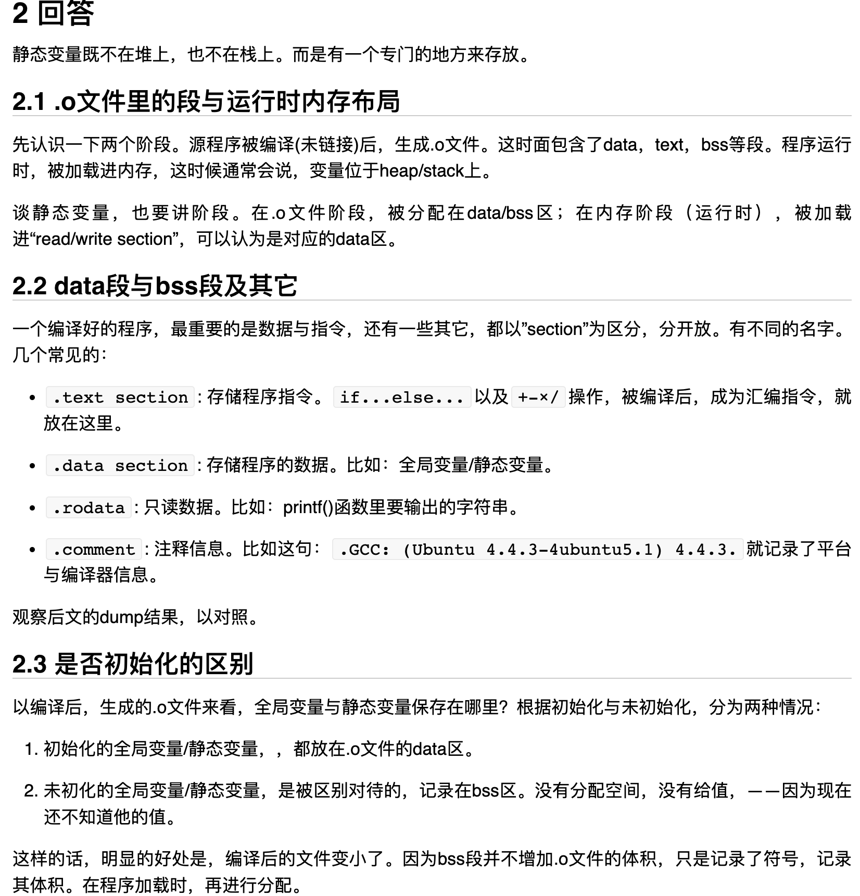
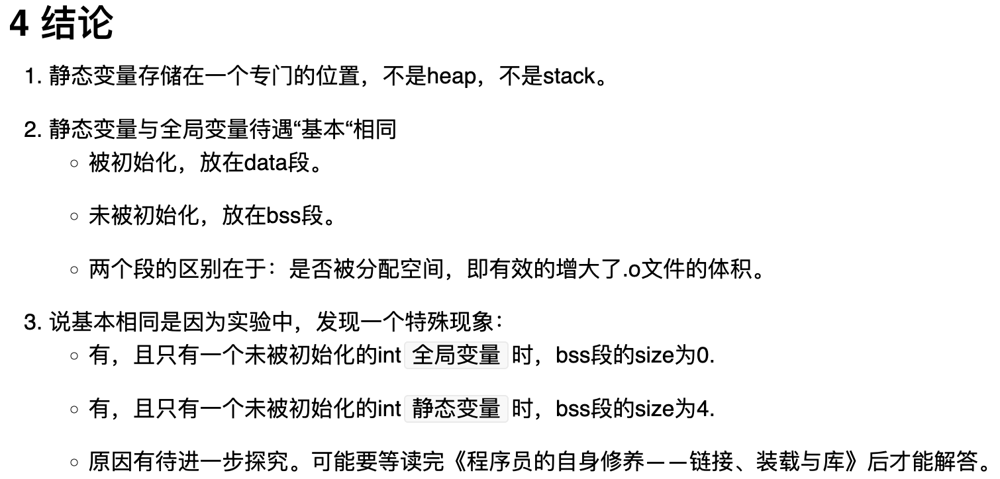

# 理论

https://xueyayang.github.io/2014/03/15/Static%E5%8F%98%E9%87%8F%E5%AD%98%E5%82%A8%E5%9C%A8%E5%93%AA%E9%87%8C.html

可以看到，static起了很重要的作用。 之前知道：

1. 全局变量,以及用new/malloc来分配空间的变量，内存来自于heap，不用担心被提前释放。负面是，如果没有人释放的话，程序结束之前也不会被释放。就是“内存泄露”了。
2. 局部变量，内存来自stack，随时用，随时分配。方便灵活。负面是，一旦出了“作用域”，就会自动被释放。

所以问题很自然：**局部静态变量，既不担心被提前释放，又不担心内存泄露，到底是存储在哪里的？为什么会有这优势？**

静态变量既不在堆上，也不在栈上。而是有一个专门的地方来存放。

