# 操作系统

- [1. 虚拟内存和物理内存](#1-虚拟内存和物理内存)
  - [1.1. 虚拟内存管理](#11-虚拟内存管理)
- [2. 进程调度算法](#2-进程调度算法)
- [3. 进程](#3-进程)
  - [3.1. 进程内存布局](#31-进程内存布局)
- [4. .o 文件的段](#4-o-文件的段)
- [5. 函数返回结构体原理](#5-函数返回结构体原理)
- [6. 内核态（系统态）/用户态](#6-内核态系统态用户态)
  - [6.1. 中断](#61-中断)
  - [6.2. 系统调用](#62-系统调用)
  - [6.3. 系统调用、异常、中断简单对比](#63-系统调用异常中断简单对比)
- [7. 程序状态字](#7-程序状态字)
- [8. 进程和线程切换](#8-进程和线程切换)
  - [切换过程](#切换过程)
  - [8.1. 发生进程上下文切换的场景](#81-发生进程上下文切换的场景)
  - [8.2. 线程上下文切换](#82-线程上下文切换)
  - [说说进程、线程、协程是什么，区别是什么？](#说说进程线程协程是什么区别是什么)
- [进程和线程相比，为什么慢？](#进程和线程相比为什么慢)
- [9. 进程/线程个数上限](#9-进程线程个数上限)
  - [9.1. 内核参数的影响](#91-内核参数的影响)
  - [9.2. 小结](#92-小结)
- [10. 页表管理](#10-页表管理)
  - [10.1. 分配以及释放页表](#101-分配以及释放页表)
  - [10.2. Linux 内核细节](#102-linux-内核细节)
- [11. CPU 的访存过程](#11-cpu-的访存过程)
- [12. Linux 内存管理](#12-linux-内存管理)
  - [12.1. 内核内存管理](#121-内核内存管理)
  - [12.2. 用户空间内存数据结构](#122-用户空间内存数据结构)
  - [12.3. 内核空间动态分配内存数据结构](#123-内核空间动态分配内存数据结构)
  - [12.4. 物理内存的组织](#124-物理内存的组织)
  - [12.5. 虚拟内存分配](#125-虚拟内存分配)
  - [12.6. 内核空间内存分配](#126-内核空间内存分配)
  - [12.7. 用户内存分配总览](#127-用户内存分配总览)
  - [12.8. 小结](#128-小结)
- [13. 基本地址变换机构(段氏、页式、段页式)](#13-基本地址变换机构段氏页式段页式)

## 1. 虚拟内存和物理内存

1. 物理内存四个层次
2. 虚拟内存是什么：每个进程独立虚拟地址空间，通过映射，页表（映射）寻址完成虚拟地址和物理地址转换
3. 为什么使用虚拟地址？1）进程地址空间不隔离，数据随意修改；2）内存使用率低；3）程序运行地址不确定
4. 使用虚拟地址的好处：1）扩大地址空间。每个进程独占一个4G空间，虽然真实物理内存没那么多；2）内存保护；3）可以实现内存共享；方便通信；4）可以避免内存碎片，虽然物理内存可能不连续，但映射到虚拟内存上可以连续。
5. 虚拟地址的缺点：1）额外构建数据结构，占用空间；2）地址转换，时间开销；~~3）页面换入换出开销（不算缺点，是带来的现象）；4）一页如果只有一部分数据，浪费内存，不过这个还好~~

### 1.1. 虚拟内存管理

在进程虚拟地址空间中，**并非所有的地址范围都需要页表条目**。通常情况下，由于可能存在大段的虚拟地址空间并未投入使用，故而也无必要为其维护相应的页表条目。若进程试图访问的地址并无页表条目与之对应，那么进程将受到一个SIGSEGV信号。

由于内核能够为进程分配和释放页（和页表条目），所以进程的有效虚拟地址范围在其生命周期中可以发生变化。这可能会发生于如下场景：

1. 由于栈向下增长超出之前曾达到的位置。
2. 当在堆中分配或释放内存时，通过调用brk()、sbrk()或malloc函数族来提升program break的位置。
3. 当调用shmat()连接System V共享内存区时，或者当调用shmdt()脱离共享内存区时。
4. 当调用mmap()创建内存映射时，或者当调用munmap()解除内存映射时。

虚拟内存管理是使进程的虚拟地址空间与RAM物理地址空间隔离开来，这带来许多优点：

**1）隔离，内存保护；2）共享内存进程通信；3）扩大可以使用的内存空间；4）一定程度避免内存碎片；5）减轻程序员负担，不用关注真实的物理内存**

1. **进程与进程、进程与内核相互隔离**，所以一个进程不能读取或修改另一个进程或内核的内存。这是因为每个进程的页表条目指向RAM（或交换区）中截然不同的物理页面集合。
2. 适当情况下，**两个或更多进程能够共享内存**。这是由于内核可以使不同进程的页表条目指向相同的RAM页。内存共享常发生于如下两种场景：
   - 执行同一程序的多个进程，可共享一份（只读的）程序代码副本。当多个程序执行相同的程序文件（或加载相同的共享库）时，**会隐式地实现这一类型的共享**。
   - 进程可以使用shmget()和mmap()系统调用**显示地请求与其他进程共享内存区。这么做是出于进程间通信的目的**。
3. **便于实现内存保护机制**：也就是说，可以对页表条目进行标记，以表示相关页面内容是**可读、可写、可执行**亦或是这些保护措施的组合。多个进程共享RAM页面时，允许每个进程对内存采取不同的保护措施。例如：一个进程可能以只读方式访问某页面，而另一进程则以读写方式访问同一页面。
4. 程序员和编译器、链接器之类的工具无需关注程序在RAM中的物理布局，**减轻程序员的负担**。
5. 因为需要驻留在内存中的仅是程序的一部分，**所以程序的加载和运行都很快**。而且，一个进程所占用的内存（即虚拟内存大小）能够超出RAM的容量。
6. 虚拟内存管理的最后一个优点是：由于每个进程使用的RAM减少了，RAM中同时可以容纳的进程数量就增多了。这增大了如下事件的概率：在任一时刻，**CPU都可执行至少一个进程，因而往往也会提高CPU的利用率**。

## 2. 进程调度算法

5种

先来先服务调度算法
短作业(进程)优先调度算法
高优先级优先调度算法
时间片轮转法
多级反馈队列调度算法（综合前面多种调度算法）

抢占式：用于要求比较严格的实时系统中，以及对**性能**要求较高的批处理和分时系统中。

非抢占式：批处理系统中；也可用于某些对实时性要求不严的实时系统中

非抢占式（Nonpreemptive）：让进程**运行直到结束或阻塞**的调度方式，容易实现，适合专用系统，不适合通用系统。 抢占式（Preemptive）：允许将逻辑上可继续运行的在运行过程暂停的调度方式可**防止单一进程长时间独占**，**CPU系统切换开销大**（降低途径：硬件实现进程切换，或扩充主存以贮存大部分程序）

## 3. 进程

<https://www.cnblogs.com/jingyg/p/5069964.html>

从内核角度看，进程由用户内存空间和一系列内核数据结构组成

1. 其中用户内存空间包含了程序代码及代码所使用的变量
2. 而内核数据结构则用于维护进程状态信息

### 3.1. 进程内存布局

每个进程所分配的内存由很多部分组成，通常称之为“段（segment）”：

- **文本段**：包含了进程运行的程序机器语言指令。文本段具有只读属性，以防止进程通过错误指针意外修改自身指令。因为多个进程可同时运行同一程序，所以又将**文本段设为可共享**，这样，一份程序代码的拷贝可以映射到所有这些进程的虚拟地址空间中。
- **初始化数据段**：包含显示**初始化的全局变量和静态变量**。当程序加载到内存时，从可执行文件中读取这些变量的值。
- **未初始化数据段**：包含了未进行显示初始化的全局变量和静态变量。程序启动之前，**系统将本段内所有内存初始化为0**。出于历史原因，此段常被称为**BSS段**，这源于老版本的汇编语言助记符“block started by symbol”。将经过初始化的全局变量和静态变量与未初始化的全局变量和静态变量分开存放，**其主要原因在于程序在磁盘上存储时，没有必要为未经初始化的变量分配存储空间。相反，可执行文件只需记录未初始化数据段的位置及所需大小，直到运行时再由程序加载器来分配空间，从而减小可执行文件的体积**。
- **栈（stack）**：是一个动态增长和收缩的段，有栈帧（stack frames）组成。系统会为每个当前调用的函数分配一个栈帧。栈帧中存储了函数的**局部变量（所谓自动变量）、实参和返回值**。
- **堆（heap）**：是可在运行时（为变量）动态进行内存分配的一块区域。堆顶端称为program break。

对于初始化和未初始化的数据段而言，不太常用、但表达更清晰的称为分别是**用户初始化数据段（user-initialized data segment）**和**零初始化数据段（zero-initialized data segment）**。

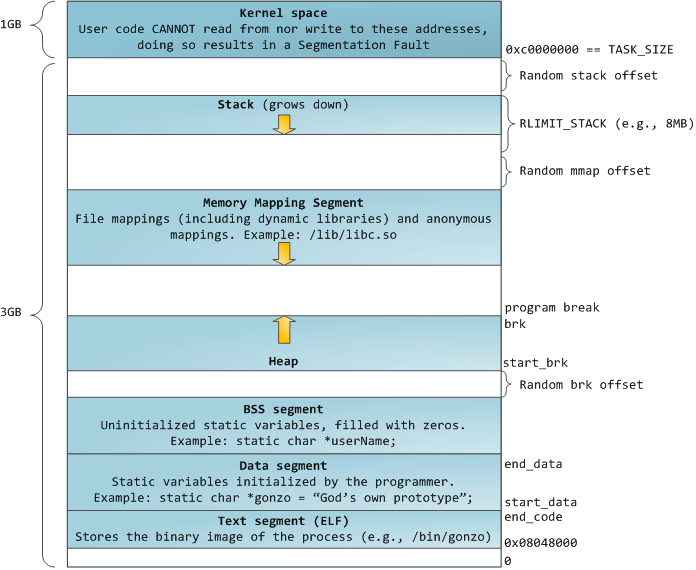

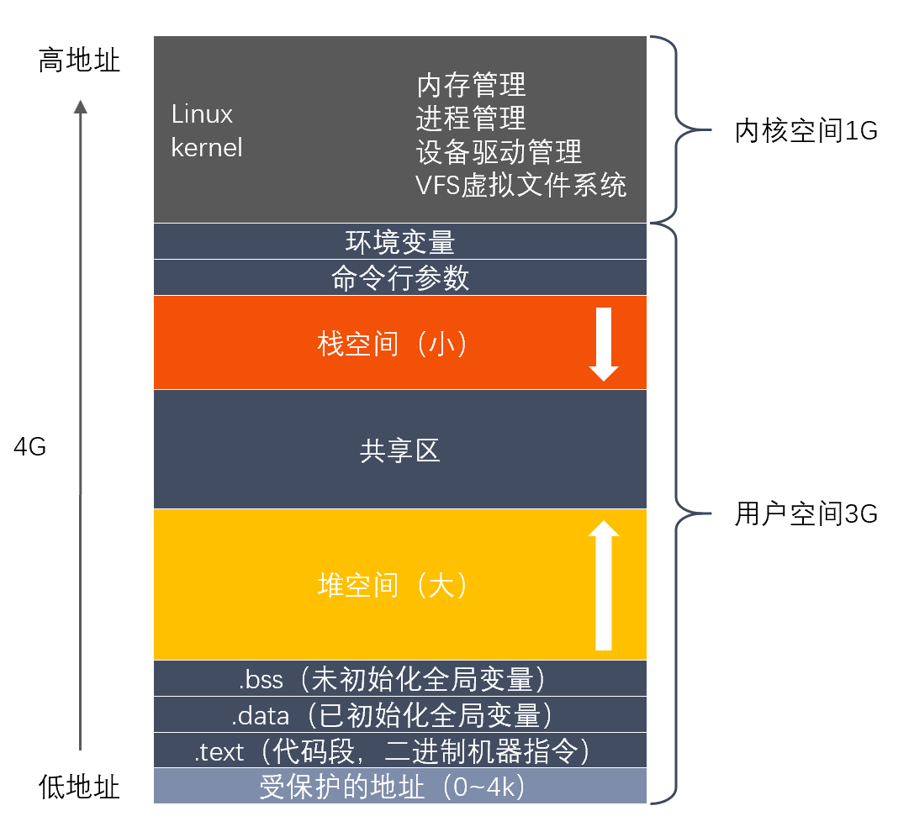

## 4. .o 文件的段

<https://murphypei.github.io/blog/2019/01/linux-heap>

不论：

1. 全局变量
2. 全局静态变量
3. 局部静态变量

未初始化或者初始化为0，则放在.bss段。
如果初始化非零值，则把它放在.data段。

> 全局变量默认是 extern
>
> int global_g_unin;
> int global_g_unin = 1;
>
> 这样是可以正常运行的

如果定义全局变量，int global_g_unin，符号表把它归为*COM*，即外部变量。

## 5. 函数返回结构体原理

可见，函数的返回值为结构体类型，其返回值既不是“值传递”也不是通过“寄存器”回传。编译器在编译此类函数时，**为其附加了一个指针参数（指向的地址在caller的堆栈上）**，且作为函数的第一个参数（函数本身的参数依次后移），函数语义上的返回值通过该附加的指针参数回传，而函数真正的返回值就是该指针。

函数的参数从右至左依次入栈

## 6. 内核态（系统态）/用户态

操作系统的两种运行级别，内核态拥有最高权限，可以访问所有系统指令；用户态则只能访问一部分指令。

**内核态/用户态如何切换？**

切换到内核态：

1. 系统调用
2. 中断
3. 异常

系统调用是主动的，另外两种是被动的。

切换到用户态：核心态→用户态”的切换是通过执行一个特权指令，将程序状态字(PSW)的标志位设置为“用户态”

为什么区分内核态？

区分内核态与用户态主要是出于**安全的考虑**。在CPU的所有指令中，有一些指令是非常危险的，如果错用，将导致整个系统崩溃。比如：清内存、设置时钟等。

### 6.1. 中断

<https://blog.csdn.net/Shangxingya/article/details/113664779>

发生了中断，就意味着需要**操作系统介入**，开展管理工作。

由于操作系统的管理工作（比如进程切换、分配i/o设备等）需要使用**特权指令**，因此CPU要从用户态转为核心态。

有了**中断**，才能实现**多道程序并发执行**。

#### 6.1.1. 中断的分类

中断分为**内中断**和**外中断**, 核心区别就是这个中断信号的来源, 内中断是本CPU运行这段代码段所发出的, 外中断是其他CPU执行代码段发来的, 也就是与当前CPU执行的指令无关.

#### 6.1.2. 中断的处理过程

Step 1:执行完每个指令之后，CPU都要检查当前是否有外部中断信号
Step 2:如果检测到外部中断信号，则需要保护被中断进程的CPU环境（如程序状态字PSw、程序计数器PC、各种通用寄存器)（设置中断标记，如果不能嵌套中断）
Step 3:根据中断信号类型（中断向量表）转入相应的中断处理程序(进入内核态)
Step 4:恢复原进程的CPU环境并退出中断，返回原进程继续往下执行（清除中断标记，如果不能嵌套中断）

> 当Intel CPU运行在32位保护模式下时，需要使用中断描述符表（Interrupt Descriptor Table，IDT）来管理中断或异常。IDT是Intel 8086～80186 CPU中使用的中断向量表的直接替代物。

**和进程切换不同，切换到内核，不需要刷新页表，tlb**；

根本原因在于，用户和内核都有**自己独立的堆栈**，它们的虚拟地址空间不重叠。

**另外一个不同**是：进程切换需要恢复切换进来的进程的上下文，而中断和系统调用不用，但也有会有一些额外的处理，跟具体的实现架构系统有关，不是很了解。

中断上下文，其实只包括内核态中断服务程序执行所必需的状态，包括**CPU 寄存器、内核堆栈、硬件中断**参数等。

### 6.2. 系统调用

操作系统作为用户和计算机硬件之间的接口，需要向上提供一些简单易用的服务。
主要包括命令接口和程序接口。其中，程序接口由一组系统调用组成。

**“系统调用”是操作系统提供给应用程序（程序员/编程人员）使用的接口，可以理解为一种可供应用程序调用的特殊函数，应用程序可以发出系统调用请求来获得操作系统的服务。**

系统中的各种共享资源都由操作系统统一掌管，因此**在用户程序中，凡是与资源有关的操作（如存储分配、I/O操作、文件管理等）**，都必须通过系统调用的方式向操作系统提出服务请求，由操作系统代为完成。

而每一个系统调用背后的功能都涉及到对应的资源管理和进程控制, 这些指令都是一些特权指令, 所以需要进行用户态到内核态的改变


可见系统调用，**有些**也是通过中断来实现的，属于内中断。

**传递系统调用参数→执行陷入指令(用户态）→执行系统调用相应服务程序（核心态）→返回用户程序**

1.陷入指令是在用户态执行的，执行陷入指令之后立即引发一个内中断，从而CPU进入核心态
2.发出系统调用请求是在用户态，而对系统调用的相应处理在核心态下进行
3.**陷入指令是唯一 一个只能在用户态执行，而不可在核心态执行的指令**

系统调用通过陷入指令trap来实现的，在程序员眼中，系统调用和普通函数没有什么区别，但底层的却设计内核态的切换。

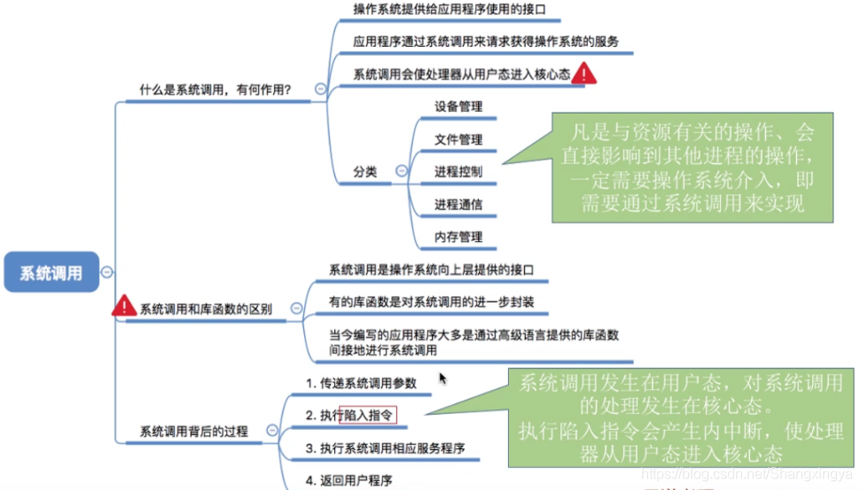

系统调用过程中，并不会涉及到虚拟内存等进程用户态的资源，也不会切换进程。这跟我们通常所说的进程上下文切换是不一样的：进程上下文切换，是指从一个进程切换到另一个进程运行；而**系统调用过程中一直是同一个进程在运行**。

一般的，进程是不能访问内核的。它不能访问内核所占内存空间也不能调用内核函数。CPU硬件决定了这些(这就是为什么它被称作"保护模式")。**系统调用是这些规则的一个例外。其原理是进程先用适当的值填充寄存器，然后调用一个特殊的指令，这个指令会跳到一个事先定义的内核中的一个位置(当然，这个位置是用户进程可读但是不可写的)。在Intel CPU中，这个由中断0x80实现**。硬件知道一旦你跳到这个位置，你就不是在限制模式下运行的用户，而是作为操作系统的内核--所以你就可以为所欲为。

进程可以跳转到的内核位置叫做sysem_call。这个过程检查系统调用号，这个号码告诉内核进程请求哪种服务。然后，它查看系统调用表(sys_call_table)找到所调用的内核函数入口地址。接着，就调用函数，等返回后，做一些系统检查，最后返回到进程(或到其他进程，如果这个进程时间用尽)。

### 6.3. 系统调用、异常、中断简单对比

<https://blog.csdn.net/baidu_28312631/article/details/47375209>

1. 系统调用（system call）：应用程序主动向操作系统发出的服务请求
2. 异常(exception)：非法指令或者其他原因导致当前指令执行失败(如：内存出错)后的处理请求，除0等
3. 中断(hardware interrupt)：来自硬件设备的处理请求

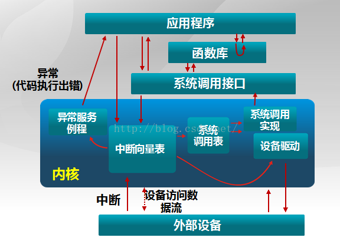

现在，正式开始从如下几个方面对三者进行比较：

1. 源头
   - 中断：外设引起
   - 异常：应用程序意想不到的行为
   - 系统调用：应用程序请求操作系统提供服务
2. 响应方式
   - 中断：异步
   - 异常：同步
   - 系统调用：异步或同步
3. 处理机制
   - 中断：持续，对用户应用程序是透明的
   - 异常：杀死或者重新执行意想不到的应用程序指令
   - 系统调用：等待和持续

## 7. 程序状态字

程序状态字（Program Status Word, PSW）又称**状态寄存器**，主要用于反映处理器的状态及某些计算结果以及控制指令的执行。用一个专门的寄存器来指示处理器状态。

程序状态字通常包括以下状态代码：

1. **CPU的工作状态码**：指明**管态还是目态**，用来说明当前在CPU上执行的是操作系统还是一般用户，从而决定其是否可以使用特权指令或拥有其它的特殊权力
2. 条件码：反映指令执行后的结果特征，如进位，溢出
3. 中断屏蔽码：指出是否允许中断

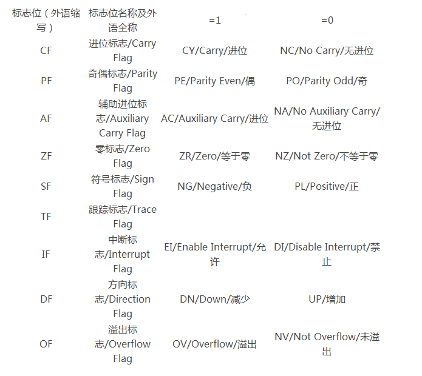

## 8. 进程和线程切换

1. **进程切换**：通用寄存器，程序状态字（PSW），程序计数器（PC），页表切换（通过修改页表基址寄存器（page table base register）,简称PTBR/PTR，如，X86下的CR3；同时~~cache~~、tlb需要刷新）；都是内核实现

**对于虚拟地址的cache，需要注意刷新问题；而采用物理地址的cache，不需要刷新**

> Cache 有多种类型，PIPT VIVT VIPT等等，不同的Cache在进程切换时采用不同的处理方式。

TLB刷新：全刷新/部分刷新（内核页表，共享页表不需要刷新，通过标志位识别）

每次切换进程刷新cache，但代价很高。某些CPU体系结构在其高速缓存行中有空间供 **ASID（地址空间标识符）**使用，该ID是进程ID的硬件版本，也由MMU使用。这样可以有效地将缓存项与不同进程分开，这意味着映射同一页面的两个进程将具有同一物理页面的不一致视图（通常会有一个特殊的ASID值指示共享页面）；但是如果没有将它们映射到相同的地址，则需要刷新它们。如果操作系统注意到（识别出）不同的进程使用不重叠的虚拟地址空间（这违反了使用虚拟内存的某些目的，但有时可以做到），则缓存行将保持有效。

**TLB类似**：必须在上下文切换期间管理TLB本身。如果TLB条目包含ASID，则它们可以保留在原位；如果操作系统的ASID的含义已更改（例如，因为进程已退出），则操作系统仅需要刷新TLB条目。如果TLB条目是全局的（没有ASID），则在切换到其他上下文时必须使它们无效。

2. **线程切换**：由于同一个进程的不同线程共享虚拟地址空间，因此线程切换**只需要切换寄存器等上下文**（PC，堆栈寄存器，通用寄存器）

进程是由**内核**来管理和调度的，进程的切换只能发生在内核态。所以，进程的上下文不仅包括了虚拟内存、栈、全局变量等用户空间的资源，**还包括了内核堆栈、寄存器等内核空间的状态**。

lmbench显示的**进程**上下文切换耗时从**2.7us到5.48**之间。
线程的切换ns级别
协程的切换只需要十几个cpu cycle

### 切换过程

**进程上下文切换**

（1）保护被中断进程的**处理器现场信息**

（2）修改被中断进程的**进程控制块**有关信息，如进程状态等

（3）把被中断进程的进程控制块加入有关**队列**

（4）选择下一个占有处理器运行的进程

（5）根据被选中进程设置操作系统用到的地址转换和存储保护信息

切换**页目录**以使用新的地址空间

**切换内核栈**和硬件上下文（包括分配的内存，数据段，堆栈段等）

（6）根据被选中进程恢复处理器现场

**线程上下文切换**

（1）保护被中断线程的处理器现场信息

（2）修改被中断线程的线程控制块有关信息，如线程状态等

（3）把被中断线程的线程控制块加入有关队列

（4）选择下一个占有处理器运行的线程

（5）根据被选中线程设置操作系统用到的存储保护信息

        切换内核栈和硬件上下文（切换堆栈，以及各寄存器）

（6）根据被选中线程恢复处理器现场

### 8.1. 发生进程上下文切换的场景

为了保证所有进程可以得到公平调度，CPU 时间被划分为一段段的**时间片**，这些时间片再被轮流分配给各个进程。这样，当某个进程的时间片耗尽了，就会被系统挂起，切换到其它正在等待 CPU 的进程运行。

进程在**系统资源不足**（比如内存不足）时，要等到资源满足后才可以运行，这个时候进程也会被挂起，并由系统调度其他进程运行。

当进程通过**睡眠**函数 sleep 这样的方法将自己主动挂起时，自然也会重新调度。

当有**优先级更高的进程运行**时，为了保证高优先级进程的运行，当前进程会被挂起，由高优先级进程来运行

发生硬件**中断**时，CPU 上的进程会被中断挂起，转而执行内核中的中断服务程序。

### 8.2. 线程上下文切换

线程与进程最大的区别在于：**线程是调度的基本单位，而进程则是资源拥有的基本单位**。说白了，所谓内核中的任务调度，实际上的调度对象是线程；而进程只是给线程提供了虚拟内存、全局变量等资源。

### 说说进程、线程、协程是什么，区别是什么？

线程与进程的区别：

（1）一个线程从属于一个进程；一个进程可以包含多个线程。
（2）一个线程挂掉，对应的进程挂掉；一个进程挂掉，不会影响其他进程。
（3）进程是**系统资源调度的最小单位**；线程CPU调度的最小单位。
（4）进程系统开销显著大于线程开销；线程需要的系统资源更少。
（5）进程在执行时拥有独立的内存单元，多个线程共享进程的内存，如代码段、数据段、扩展段；但每个线程拥有自己的栈段和寄存器组。
（6）进程切换时需要刷新TLB并获取新的地址空间，然后切换硬件上下文和内核栈，线程切换时只需要切换硬件上下文和内核栈。
（7）通信方式不一样。
（8）进程适应于多核、多机分布；线程适用于多核

线程与协程的区别：

（1）**协程切换效率高**。**协程直接操作栈基本没有内核切换的开销**，所以上下文的切换非常快，切换开销比线程更小。
（2）**协程执行效率极高**，协程不需要多线程的锁机制，因为多个协程从属于一个线程，不存在同时写变量冲突，**效率比线程高**。
（3）**协程占用内存少**：执行协程只需要极少的栈内存（大概是4～5KB），而默认情况下，线程栈的大小为1MB。
（4）一个线程可以有多个协程。

本质上说，协程是对执行过程更加细腻的控制，可以实现更加符合场景的并发控制，效率更高。

**协程是一种用户态线程**.它比线程更加轻量并且协程对于操作系统是并不可见的.操作系统看到的就是一个物理线程在执行，并不知道里面执行哪个协程。除了这点不同外，其他和普通的线程基本一样，协程也有独立的栈，只不过协程切换时，栈的切换是由用户管理的

协程使用时，注意不要锁住整个线程，否则造成整个线程阻塞，其他协程也运行不了。

## 进程和线程相比，为什么慢？

1. 进程需要更多的资源。
2. 进程切换开销大，多进程切换时需要刷新TLB并获取新的地址空间，然后切换硬件上下文和内核栈；多线程切换时只需要切换硬件上下文和内核栈。
3. 进程通信比线程通信开销大。进程通信需要借助管道、队列、共享内存，需要额外申请空间，通信繁琐；而线程共享进程的内存，如代码段、数据段、扩展段，通信快捷简单，同步开销更小。

## 9. 进程/线程个数上限

<https://blog.51cto.com/u_14888059/3795275>

内存划分：

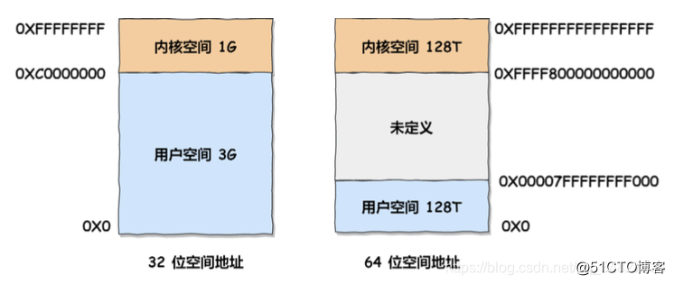

1. 32 位系统的内核空间占用 1G ，位于最高处，剩下的 3G 是用户空间;
2. 64 位系统的内核空间和用户空间都是 128T ，分别占据整个内存空间的最高和最低处，剩下的中
间部分是未定义的。

进程里创建一个线程需要消耗多少虚拟内存大小？

`ulimit -a `

默认分配给线程的栈空间大小为 8M

那么假设创建一个线程需要占用 10M 虚拟内存，总共有 3G 虚拟内存可以使用。于是我们可以算出，最多可以创建差不多 300 个（3G/10M）左右的线程。

所以，通过调低栈空间大小，可以提高线程数上限。

### 9.1. 内核参数的影响

事实上，肯定创建不了那么多线程，除了虚拟内存的限制，还有系统的限制。

比如下面这三个内核参数的大小，都会影响创建线程的上限：

- /proc/sys/kernel/threads-max，表示系统支持的最大线程数，默认值是 14553；
- /proc/sys/kernel/pid_max，表示系统全局的 PID 号数值的限制，每一个进程或线程都有 ID，ID 的值超过这个数，进程或线程就会创建失败，默认值是 32768；
- /proc/sys/vm/max_map_count，表示限制一个进程可以拥有的VMA(虚拟内存区域)的数量，具体什么意思我也没搞清楚，反正如果它的值很小，也会导致创建线程失败，默认值是 65530。

### 9.2. 小结

我们可以运行那个测试线程数的程序后，看下当前系统的线程数是多少，可以通过 `top -H` 查看。

- 32 位系统，用户态的虚拟空间只有 3G，如果创建线程时分配的栈空间是 10M，那么一个进程最多只能创建 300 个左右的线程。
- 64 位系统，用户态的虚拟空间大到有 128T，理论上不会受虚拟内存大小的限制，而会受系统的参数或性能限制。

## 10. 页表管理

<https://www.zymseo.com/system_227430>
<https://www.cnblogs.com/zhaoyl/p/3695517.html>

linux 进程页表存在内核空间.

页表基址和起始地址差不多，后面的页表的地址在这个地址的基础上加上一个数。这个数要看你的一个页有多大。

要实现一次内存访问，实际上内存被访问了N+1次（N=页表级数），并且还需要做N次加法运算。所以，地址映射必须要有硬件支持，mmu（内存管理单元）就是这个硬件。并且需要有cache来保存页表，这个cache就是TLB（Translation lookaside buffer）。

<https://www.cnblogs.com/linhaostudy/p/12785511.html>

Linux系统中每个进程对应用户空间的pgd是不一样的，但是linux内核 的pgd是一样的。当创建一个新的进程时，都要为新进程创建一个新的页面目录PGD，并从内核的页面目录swapper_pg_dir中复制内核区间页面目录项至新建进程页面目录PGD的相应位置，

这样一来，每个进程的页面目录就分成了两部分，第一部分为“用户空间”，用来映射其整个进程空间（0x0000 0000－0xBFFF FFFF）即3G字节的虚拟地址；第二部分为“系统空间”，用来映射（0xC000 0000－0xFFFF FFFF）1G字节的虚拟地址。

**每个进程有它自己的PGD( Page Global Directory)，它是一个物理页，并包含一个pgd_t数组。**

术语：

- PTE: 页表项（page table entry）
- PGD(Page Global Directory)
- PUD(Page Upper Directory)
- PMD(Page Middle Directory)
- PT(Page Table)

PGD中包含若干PUD的地址，PUD中包含若干PMD的地址，PMD中又包含若干PT的地址。每一个页表项指向一个页框，页框就是真正的物理内存页。

每一个页框都是一个4kb的页，**假设**一个PTE是8字节，则4层共可以索引的地址大小为 (4*1024/8)^4 * 4kb = 64 GB * 4KB = 256TB; 三层则是 512GB，足够支撑目前的硬件。32位系统里面应该是三层。

其他计算：

1. 页目录表共有1K个表项，每个表项为4个字节，因此页目录大小为4K，存储在一专个4K字节的页面中属。
2. 一个页表也存储在一个4K字节的页面中。包含1K个表项，每个表项为4个字节，大小4K。
3. 如果一个进程真的要用到全部4G(32位机哈～～)的存储空间，那所有的页表所占用的空间为:
一个页表大小4K*1024个页表=4M
这样页目录表和页表所占用的空间为
4K+4M
相对于将 所有的页表项存储在一个表中（不分页目录表和页表），该表最大将占4M字节连续的物理存储空间还要多4K。

但是传说这个概率为0，所以页表不会占用达到4M。这样就节省了空间。

> 注意的是，页的大小有不同的级别：
>
> ```cpp
> #if defined(CONFIG_IA64_PAGE_SIZE_4KB)
> # define PAGE_SHIFT 12
> #elif defined(CONFIG_IA64_PAGE_SIZE_8KB)
> # define PAGE_SHIFT 13
> #elif defined(CONFIG_IA64_PAGE_SIZE_16KB)
> # define PAGE_SHIFT 14
> #elif defined(CONFIG_IA64_PAGE_SIZE_64KB)
> # define PAGE_SHIFT 16
> ```
>
> 也就是，实际的寻址范围更大

<https://puqiyuan.github.io/kernel/mm/mm_series/ptm.html>

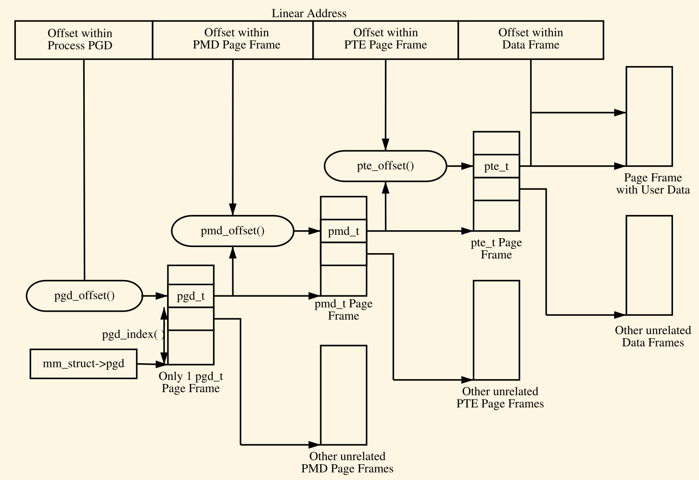

每一个pgd页表里的条目指向包含有许多pmd条目的页框基地址

PTE中存储真实的物理地址，低12bit可以用来保存一些状态信息：

| 比特                | 功能 |
| --- | --- |
| _PAGE_PRESENT      | 页面在内存中并且没有被换出 |
| _PAGE_PROTNONE     | 页面在内存中, 但是不可访问
| _PAGE_RW           | 如果页面可写就设置
| _PAGE_USER         | 如果页面可以从用户空间访问就设置
| _PAGE_DIRTY        | 页面被写过
| _PAGE_ACCESSED     | 页面被访问过

### 10.1. 分配以及释放页表

最后再介绍几个页表的分配与释放函数。如前所述，**页表也是物理页面**，只不过是包含有许多条目，分配与释放物理页面是一个相对昂贵的操作，昂贵的意思是，时间消耗大，**另外在页面分配期间中断不能打开。不论在哪个级别，页表的分配与删除都是十分频繁的操作**，所以这些操作保持尽量的快是十分重要的。

因此用于页表的页是**缓存**起来了的，不过对于各个缓存的实现却是架构相异的。比如对于PGD的缓存不是每个架构都实现了，**因为PGD的变化仅存在于进程创建或销毁时**。对于PGD，PMD以及PTE来说，各有两套释放和分配函数，即pgd_alloc，pmd_alloc以及pte_alloc三个分配的函数。另外是pfd_free，pmd_free以及pte_free三个释放的函数。

### 10.2. Linux 内核细节

每个进程对应一个task结构，它指向一个mm结构，这就是该进程的内存管理器。（对于线程来说，每个线程也都有一个task结构，但是它们都指向同一个mm，所以地址空间是共享的。）
mm->pgd指向容纳页表的内存，每个进程有自已的mm，每个mm有自己的页表。

**用户程序对内存的操作并不会直接影响到页表，更不会直接影响到物理内存的分配**。比如malloc成功，仅仅是改变了**某个vma**，页表不会变，物理内存的分配也不会变。假设用户分配了内存，然后访问这块内存。由于页表里面并没有记录相关的映射，CPU产生一次**缺页异常**。内核捕捉异常，检查产生异常的地址是不是存在于一个合法的vma中。如果不是，则给进程一个"段错误"，让其崩溃；如果是，则分配一个物理页，并为之建立映射。

## 11. CPU 的访存过程

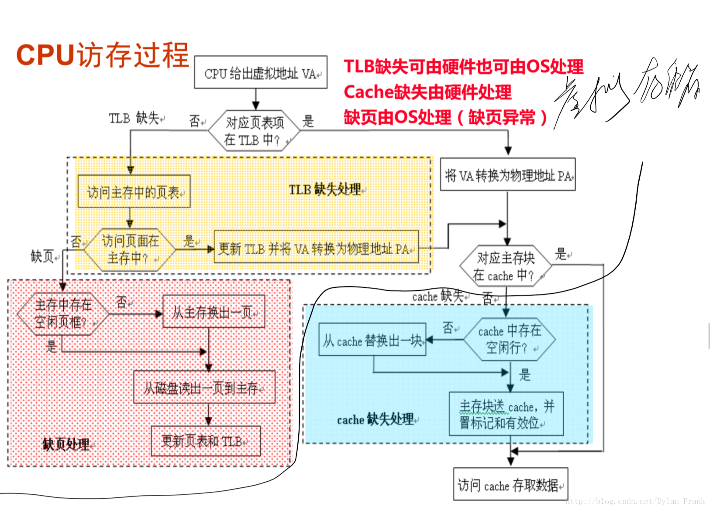

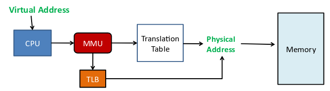

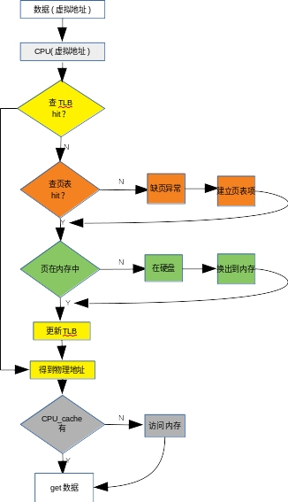

1. cpu发出虚拟地址（MMU负责地址转换）
2. TLB
3. 若缺失，内存查页表（缺失则缺页中断）
4. 页缺失，则从硬盘加载到主存
5. 更新TLB
6. 得到物理地址
7. CPU Cache
8. 不命中，主存
9. 得到数据

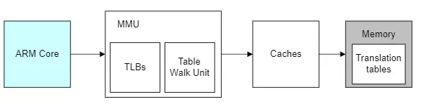

## 12. Linux 内存管理

<https://zhuanlan.zhihu.com/p/149581303>

### 12.1. 内核内存管理

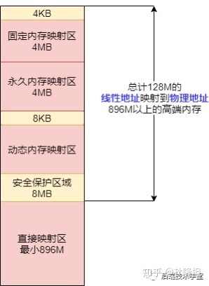

**直接映射区**：从内核空间起始地址开始，最大**896M**的内核空间地址区间，为直接内存映射区。内核地址空间的线性地址0xC0000001所对应的物理地址为0x00000001，它们之间相差一个偏移量PAGE_OFFSET = 0xC0000000

**高端内存线性地址空间**

内核空间拿出了最后的 128M 地址区间，划分成下面三个高端内存映射区，以达到对整个物理地址范围的寻址。**而在 64 位的系统上就不存在这样的问题了，因为可用的线性地址空间远大于可安装的内存。**

1. 动态内存映射区
vmalloc Region 该区域由内核函数vmalloc来分配，特点是：线性空间连续，但是对应的物理地址空间不一定连续。vmalloc 分配的线性地址所对应的物理页可能处于低端内存，也可能处于高端内存。

2. 永久内存映射区
Persistent Kernel Mapping Region 该区域可访问高端内存。访问方法是使用 alloc_page (_GFP_HIGHMEM) 分配高端内存页或者使用kmap函数将分配到的高端内存映射到该区域。

3. 固定映射区
Fixing kernel Mapping Region 该区域和 4G 的顶端只有 4k 的隔离带，其每个地址项都服务于特定的用途，如 ACPI_BASE 等。

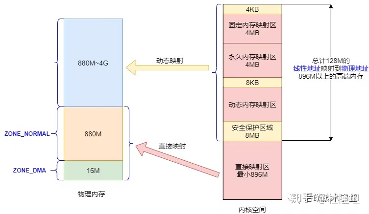

Linux 内核会将物理内存(1GB)分为3个管理区，分别是：

1. ZONE_DMA: DMA内存区域。包含0MB~16MB之间的内存页框，可以由老式基于ISA的设备通过DMA使用，直接映射到内核的地址空间。
2. ZONE_NORMAL: 普通内存区域。包含16MB~896MB之间的内存页框，常规页框，直接映射到内核的地址空间。
3. ZONE_HIGHMEM: 高端内存区域。包含896MB以上的内存页框，不进行直接映射，可以通过永久映射和临时映射进行这部分内存页框的访问。

### 12.2. 用户空间内存数据结构

在前面「进程与内存」章节我们提到，Linux进程可以划分为 5 个不同的内存区域，分别是：代码段、数据段、BSS、堆、栈，内核管理这些区域的方式是，**将这些内存区域抽象成vm_area_struct的内存管理对象**。

vm_area_struct是描述进程地址空间的基本管理单元，一个进程往往需要多个vm_area_struct来描述它的用户空间虚拟地址，**需要使用「链表」和「红黑树」来组织各个vm_area_struct**。

链表用于需要遍历全部节点的时候用，而红黑树适用于在地址空间中定位特定内存区域。内核为了内存区域上的各种不同操作都能获得高性能，所以**同时**使用了这两种数据结构。

### 12.3. 内核空间动态分配内存数据结构

在内核空间章节我们提到过「动态内存映射区」，该区域由内核函数vmalloc来分配，特点是：线性空间连续，但是对应的物理地址空间不一定连续。vmalloc 分配的线性地址所对应的物理页可能处于低端内存，也可能处于高端内存。

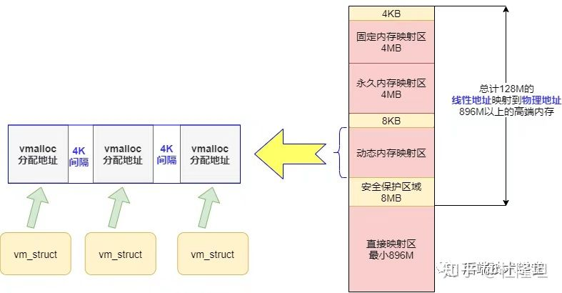

### 12.4. 物理内存的组织

**node** 目前计算机系统有两种体系结构：

- 非一致性内存访问 NUMA（Non-Uniform Memory Access）：意思是内存被划分为各个node，访问一个node花费的时间取决于CPU离这个node的距离。每一个cpu内部有一个本地的node，访问本地node时间比访问其他node的速度快
- 一致性内存访问 UMA（Uniform Memory Access）：也可以称为SMP（Symmetric Multi-Process）对称多处理器。意思是所有的处理器访问内存花费的时间是一样的。也可以理解整个内存只有一个node

**zone**

对于一块物理内存，又划分为几个区域，每个区域有特殊的含义

**page**

代表一个物理页，在内核中一个物理页用一个struct page表示

**page frame**

为了描述一个物理page，内核使用struct page结构来表示一个物理页。假设一个page的大小是4K的，内核会将整个物理内存分割成一个一个4K大小的物理页，而4K大小物理页的区域我们称为page frame

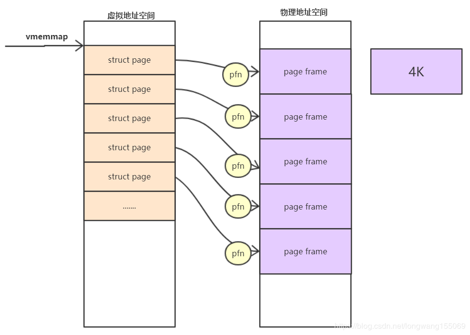

pfn是对每个page frame的编号。故物理地址和pfn的关系是：

`物理地址>>PAGE_SHIFT = pfn`

系统启动的时候，内核会将整个struct page映射到内核虚拟地址空间vmemmap的区域，所以我们可以简单的认为struct page的基地址是vmemmap，则：

vmemmap+pfn的地址就是此struct page对应的地址。

**物理内存的分配和回收都是基于内存页进行，把物理内存分页管理的好处大大的。**

存在的问题：

- 外部碎片：分配大空间时，内核尽量分配连续的，容易产生中间的零星空闲页
- 内部随便：分配小空间，一次分配一个页，页内可能采用Slab算法？页内会有碎片

#### 12.4.1. 伙伴算法 Buddy

Linux 内核引入了伙伴系统算法（Buddy system），什么意思呢？就是把相同大小的页框块用链表串起来，页框块就像手拉手的好伙伴，也是这个算法名字的由来。

具体的，所有的空闲页框分组为11个块链表，每个块链表分别包含大小为1，2，4，8，16，32，64，128，256，512和1024个连续页框的页框块。最大可以申请1024个连续页框，对应4MB大小的连续内存。

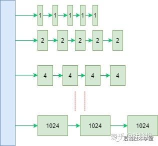

因为任何正整数都可以由 2^n 的和组成，所以总能找到合适大小的内存块分配出去，减少了外部碎片产生 。

比如：我需要申请4个页框，但是长度为4个连续页框块链表没有空闲的页框块，伙伴系统会从连续8个页框块的链表获取一个，并将其拆分为两个连续4个页框块，取其中一个，另外一个放入连续4个页框块的空闲链表中。释放的时候会检查，释放的这几个页框前后的页框是否空闲，能否组成下一级长度的块。

**Linux分区页框分配器**

有时候**目标管理区不一定有足够的页框去满足分配**，这时候系统会从另外两个管理区中获取要求的页框，但这是按照一定规则去执行的，如下：

如果要求从DMA区中获取，就只能从ZONE_DMA区中获取。
如果没有规定从哪个区获取，就按照顺序从 ZONE_NORMAL -> ZONE_DMA 获取。
如果规定从HIGHMEM区获取，就按照顺序从 ZONE_HIGHMEM -> ZONE_NORMAL -> ZONE_DMA 获取。

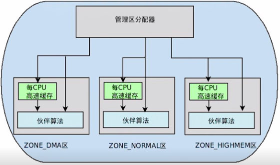

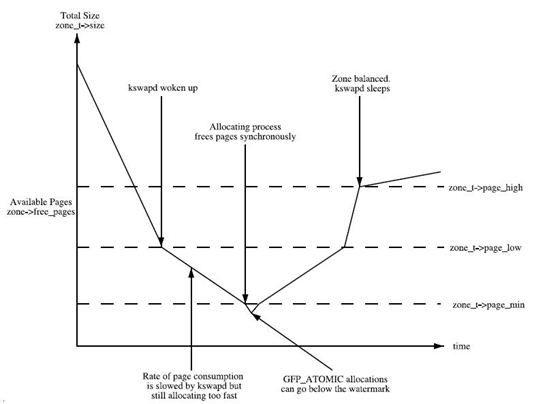

从这张图可以看出：

1. 如果空闲页数目min值，则该zone非常缺页，页面回收压力很大，应用程序写内存操作就会被阻塞，直接在应用程序的进程上下文中进行回收，即direct reclaim。
2. 如果空闲页数目小于low值，kswapd线程将被唤醒，并开始释放回收页面。
3. 如果空闲页面的值大于high值，则该zone的状态很完美, kswapd线程将重新休眠。

这是对于某一个zone的回收触发算法。

#### 12.4.2. slab分配器

一般来说，**内核对象的生命周期是这样的**：分配内存-初始化-释放内存，内核中有大量的小对象，比如文件描述结构对象、任务描述结构对象，如果按照伙伴系统按页分配和释放内存，对小对象频繁的执行「分配内存-初始化-释放内存」会非常消耗性能。

伙伴系统分配出去的内存还是以页框为单位，而对于内核的很多场景都是分配小片内存，远用不到一页内存大小的空间。slab分配器，「**通过将内存按使用对象不同再划分成不同大小的空间**」，应用于内核对象的缓存。

伙伴系统和slab不是二选一的关系，slab 内存分配器是对伙伴分配算法的补充。

1. slab 内存管理基于内核小对象，不用每次都分配一页内存，充分利用内存空间，避免内部碎片。
2. slab 对内核中频繁创建和释放的小对象做缓存，重复利用一些相同的对象，减少内存分配次数

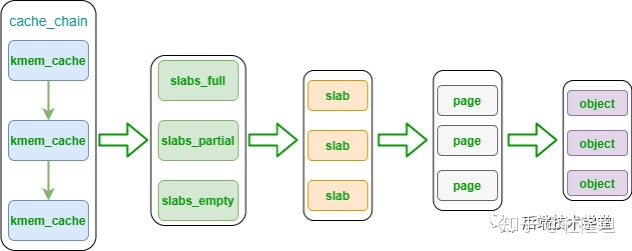

kmem_cache 是一个cache_chain 的链表组成节点，代表的是一个内核中的相同类型的「对象高速缓存」，每个kmem_cache 通常是一段连续的内存块，包含了三种类型的 slabs 链表：

- slabs_full (完全分配的 slab 链表)
- slabs_partial (部分分配的slab 链表)
- slabs_empty ( 没有被分配对象的slab 链表)

slab 是slab 分配器的最小单位，在实现上一个 slab 由一个或多个连续的物理页组成（通常只有一页）。单个slab可以在 slab 链表之间移动，例如如果一个「半满slabs_partial链表」被分配了对象后变满了，就要从 slabs_partial 中删除，同时插入到「全满slabs_full链表」中去。内核slab对象的分配过程是这样的：

如果slabs_partial链表还有未分配的空间，分配对象，若分配之后变满，移动 slab 到slabs_full 链表如果slabs_partial链表没有未分配的空间，进入下一步如果slabs_empty 链表还有未分配的空间，分配对象，同时移动slab进入slabs_partial链表如果slabs_empty为空，请求伙伴系统分页，创建一个新的空闲slab， 按步骤 3 分配对象

### 12.5. 虚拟内存分配

malloc 用于申请用户空间的虚拟内存，**当申请小于 128KB 小内存的时，malloc使用 sbrk或brk 分配内存**；**当申请大于 128KB 的内存时，使用 mmap 函数申请内存；**

存在问题：
1. 由于 brk/sbrk/mmap 属于系统调用，如果每次申请内存都要产生系统调用开销，**cpu 在用户态和内核态之间频繁切换**，非常影响性能。
2. 而且，堆是从低地址往高地址增长，如果低地址的内存没有被释放，高地址的内存就不能被回收，容易产生**内存碎片**。

因此，**malloc采用的是内存池的实现方式**，先申请一大块内存，然后将内存分成不同大小的内存块，然后用户申请内存时，直接从内存池中选择一块相近的内存块分配出去。

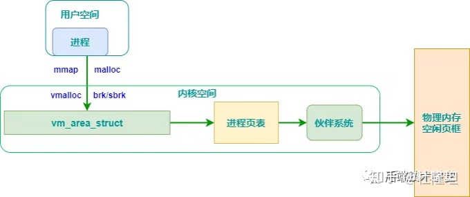

### 12.6. 内核空间内存分配

**kmalloc**

kmalloc() 分配的虚拟地址范围在内核空间的「**直接内存映射区**」。

按字节为单位虚拟内存，**一般用于分配小块内存**，释放内存对应于 kfree ，可以分配连续的物理内存。函数原型在 <linux/kmalloc.h> 中声明，一般情况下在驱动程序中都是调用 kmalloc() 来给数据结构分配内存 。

还记得前面说的 slab 吗？**kmalloc 是基于slab 分配器**的 ，同样可以用cat /proc/slabinfo 命令，查看 kmalloc 相关 slab 对象信息，下面的 kmalloc-8、kmalloc-16 等等就是基于slab分配的 kmalloc 高速缓存。

**vmalloc**

vmalloc 分配的虚拟地址区间，位于 vmalloc_start 与vmalloc_end 之间的「**动态内存映射区**」。

**一般用分配大块内存**，释放内存对应于 vfree，分配的虚拟内存地址连续，物理地址上不一定连续。函数原型在 <linux/vmalloc.h> 中声明。**一般用在为活动的交换区分配数据结构，为某些 I/O 驱动程序分配缓冲区，或为内核模块分配空间**。

下面的图总结了上述两种内核空间虚拟内存分配方式。


根据前面的系列文章，我们知道了buddy system是基于页框分配器，**kmalloc是基于slab分配器，而且这些分配的地址都是物理内存连续的**。但是随着碎片化的积累，连续物理内存的分配就会变得困难，对于那些非DMA访问，**不一定非要连续物理内存的话完全可以像malloc那样，将不连续的物理内存页框映射到连续的虚拟地址空间中，这就是vmap的来源**）（提供把**离散的page映射到连续的虚拟地址空间**），**vmalloc**的分配就是基于这个机制来实现的。

vmalloc最小分配一个page，并且分配到的页面不保证是连续的，因为vmalloc内部调用alloc_page多次分配单个页面。

**主要分以下三步：**

1. 从VMALLOC_START到VMALLOC_END查找空闲的虚拟地址空间(hole)
2. 根据分配的size,调用alloc_page依次分配单个页面.
3. 把分配的单个页面，映射到第一步中找到的连续的虚拟地址。把分配的单个页面，映射到第一步中找到的连续的虚拟地址。

**vmalloc** 分配的地址则限于vmalloc_start与vmalloc_end之间。每一块vmalloc分配的内核虚拟内存都对应一个vm_struct结构体，**不同的内核空间虚拟地址之间有4k大小的防越界空闲区间隔区**。

与用户空间的虚拟地址特性一样，这些虚拟地址与物理内存没有简单的映射关系，必须通过内核页表才可转换为物理地址或物理页，它们有可能尚未被映射，当发生**缺页**时才真正分配物理页面。

### 12.7. 用户内存分配总览

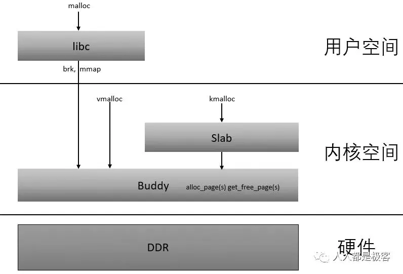

用户申请空间时，线程堆空间不足，glibc会通过brk和mmap从操作系统申请内存，此时只是申请了虚拟地址空间，并没有映射到真正的物理内存，当用户对这一块内存进行读写时，由于没有建立映射关系，引发缺页异常，分配真正的物理内存，如果物理内存不够还要根据相应的算法进行淘汰和加载，最后建立相应的映射表。

**简单来说是，分配的空间比较小（比如小于128K）时，从堆区分配，堆区不够大，调用 brk（）函数扩展；当开辟的空间大于 128K 时，调用mmap（）；但一些分配器为了并发分配，并不一定是这样，如下面的ptmalloc2**

malloc采用的是内存池的管理方式，以减少内存碎片。先申请大块内存作为堆区，然后将堆区分为多个内存块。当用户申请内存时，直接从堆区分配一块合适的空闲块

**缺页异常**：brk和mmap函数在分配内存时只是建立了进程虚拟地址空间，并没有分配虚拟内存对应的物理内存。当进程访问这些没有建立映射关系的虚拟内存时，处理器自动触发一个缺页异常，引发缺页中断。

**缺页中断**：缺页异常后将产生一个缺页中断，此时操作系统会根据页表中的外存地址在外存中找到所缺的一页，将其调入内存。

不同平台的堆内存管理机制不相同，下面是几个常见平台的堆内存管理机制：

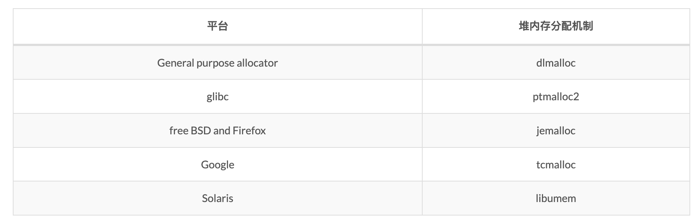

本来 Linux 默认的是 dlmalloc，但是由于其不支持多线程堆管理，所以后来被**支持多线程**的 **prmalloc2** 代替了

一下介绍在 Linux 的 glibc 使用的 ptmalloc2 实现原理。

**arena 介绍**

每个线程都有一个自己的 arena 用于堆内存的分配，这个区域是调用 malloc 的时候从操作系统获得的，简单理解是线程独享的堆。但实际上，arena的个数是跟系统中处理器核心个数相关的；

|systems	|number of arena
| --- | -- |
|32bits	|2 x number of cpu cores + 1
|64bits	|8 x number of cpu cores + 1

同步方式，简单来说是，轮询加锁的方式。

**malloc_state**

用于表示 arena 的信息，因此也被称为 **arena header**，每个线程只含有一个 arena header。arena header 包含 bin、top chunk 以及 last remainder chunk 等信息。

**heap_info**

我们把从**操作系统申请的一块内存称为一个 heap**。一个 thread arena（注意：不包含主线程）可以**包含多个 heap**。 main arena 中只包含一个可以自增长的 heap。

> 此处的 heap 并非广义上的进程的虚拟内存空间中的堆，而是子线程通过系统调用 **mmap** 从操作系统申请的一块内存空间，后面 heap 不做声明，均是这个意思

那么在什么情况下一个 thread arena 会包含多个 heap 呢？在当前 heap 不够用的时候，malloc 会通过系统调用 mmap 申请新的 heap（这部分空间本来是位于内存映射区区域），新的 heap 会被添加到当前 thread arena 中，便于管理。

可以理解成slab分配器中线程独占的chunk。

**malloc_chunk**

一个 heap 被分为多个 chunk，每个 chunk 的大小不是固定，是根据用户的请求决定的。
每个 chunk 都由一个结构体 malloc_chunk 表示，也成为 chunk header。

1. area(malloc_state，arena header)
2. heap(heap_info/heap header)
3. chunk(malloc_chunk, chunk header)

关于上述的三种结构，基本都是针对子线程的，主线程和子线程有一些不同：

1. 主线程的堆不是分配在内存映射区，而是进程的虚拟内存堆区，因此不含有多个 heap 所以也就不含有 heap_info 结构体。当需要更多堆空间的时候，直接通过增长 brk 指针来获取更多的空间，直到它**碰到内存映射区域**为止。
2. 不同于 thread arena，**主线程的 main arena 的 arena header 并不在堆区中，而是一个全局变量**，因此它属于 libc.so 的 data segment 区域。

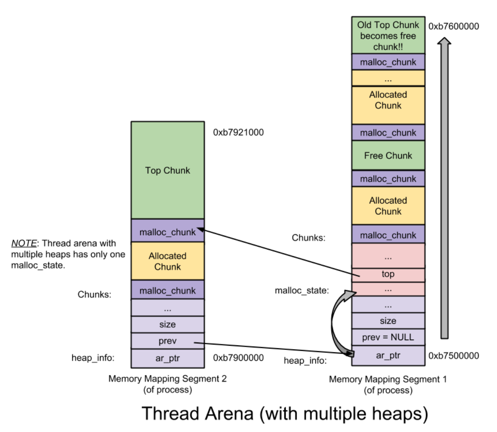

从上图可以看出，thread arena 只含有一个 malloc_state（即 arena header），却有两个 heap_info（即 heap header）。由于两个 heap 是通过 mmap 从操作系统申请的内存，两者在内存布局上并不相邻而是分属于不同的内存区间，所以为了便于管理，glibc 的 malloc 将第二个 heap_info 结构体的 prev 成员指向了第一个 heap_info 结构体的起始位置（即 ar_ptr 成员），而**第一个 heap_info 结构体的 ar_ptr 成员指向了 malloc_state**，这样就构成了一个**单链表**，方便后续管理。

#### 12.7.1. chunk 介绍

在 glibc 的 malloc 中将**整个堆内存空间分成了连续的、大小不一的 chunk**，即对于堆内存管理而言 chunk 就是最小操作单位。chunk 总共分为4类：

allocated chunk
free chunk
top chunk
last remainder chunk

堆内存中要求每个 chunk 的大小必须为8的整数倍。因此 chunk header 中的 size 变量的后 3 位是无效的，为了充分利用内存，**堆管理器将这 3 个比特位用作 chunk 的标志位**，典型的就是将第 0 比特位用于标记该 chunk 是否已经被分配。

1. **每个 chunk 的大小怎么确定？**
    用户程序调用 malloc(size_t size) 就会创建一个 chunk，传入的大小就是当前分配的 chunk 大小，这个是非常重要的。
2. 我们为什么要知道前一个 chunk 的信息？
   **为了方便合并不同的 chunk ，减少内存的碎片化**。如果不这么做， chunk 的合并只能向下合并，必须从头遍历整个堆，然后加以合并，这就意味着每次进行 chunk 释放操作消耗的时间与堆的大小成线性关系。
3. chunk 的链表是如何构成的
   chunk 在堆内存上是连续的，并不是直接由指针构成的链表，而是通过 prev_size 和 size 块构成了隐式的链表。在进行分配操作的时候，堆内存管理器可以通过遍历整个堆内存的 chunk ，分析每个 chunk 的 size 字段，进而找到合适的 chunk。

#### 12.7.2. bin 介绍

我们知道使用隐式链表来管理内存 chunk 总会涉及到内存的遍历，效率极低。对此 glibc 的 malloc 引入了显示链表技术来提高堆内存分配和释放的效率。

bin链表中的结点就是各个 chunk ，这些结点的拥有一些共同属性：

1. 均为 free chunk。
2. 同一个链表中各个 chunk 的大小相等（有一个特例，详情见后文）

bin 作为一种记录 free chunk 的链表数据结构。系统针对不同大小的 free chunk ，将 bin 分为了 4 类：

1. fast bin
2. unsorted bin
3. small bin
4. large bin

fast:

不同合并操作

unsort:

当释放较小或较大的 chunk 的时候，如果系统没有将它们添加到对应的 bin 中（为什么，在什么情况下会发生这种事情呢？详情见后文），系统就将这些 chunk 添加到 unsorted bin 中。为什么要这么做呢？这主要是为了让 glibc 的 malloc 能够有第二次机会重新利用最近释放的 chunk (第一次机会就是 fast bin 机制)。

1. unsorted bin 只有 1 个，unsorted bin 是一个由 free chunk 组成的循环双链表。
2. 不同于其他的 bin （包括 fast bin ），在 unsorted bin 中，对 chunk 的大小并没有限制，任何大小的 chunk 都可以归属到 unsorted bin 中。

small:

之后当再次调用 malloc(small chunk) 的时候，如果要申请的 chunk size 对应的 small bin 不为空，就从该 small bin 链表中取得 small chunk ，否则就需要交给 unsorted bin 及之后的逻辑来处理了。

当释放 small chunk 的时候，**先检查该 chunk 相邻的 chunk 是否为 free chunk，如果是的话就进行合并操作**：将这些 chunk 合并成新的 chunk ，然后将它们从 small bin 中移除，最后将新的 chunk 添加到 unsorted bin 中。

large bin：

arge bin 总共有63个。 large bin 类似于 small bin ，只是需要注意两点：**一是同一个 large bin 中每个 chunk 的大小可以不一样**，但必须处于某个给定的范围(特例2) ；**二是 large chunk 可以添加、删除在 large bin 的任何一个位置**。

在这 63 个 large bin 中，前 32 个 large bin 依次以 6 4字节步长为间隔，即第一个 large bin 中 chunk size 为 512~575 字节，第二个 large bin 中 chunk size 为 576~639 字节。紧随其后的 16 个 large bin 依次以 512 字节步长为间隔；之后的 8 个 bin 以步长 4096 为间隔；再之后的 4 个 bin 以 32768 字节为间隔；之后的 2 个 bin 以 262144 字节为间隔；剩下的 chunk 就放在最后一个 large bin 中。鉴于同一个 large bin 中每个 chunk 的大小不一定相同，因此为了加快内存分配和释放的速度，**就将同一个 large bin 中的所有 chunk 按照 chunk size 进行从大到小的排列**：最大的 chunk 放在链表的前端，最小的 chunk 放在尾端。

### 12.8. 小结

- glibc的分配方式和slab分配器类似，每个线程相当于独占一个- arena作为内存池，用于并发分配
- 主线程只有一个heap(vma),通过brk，从小向大增长
- 子线程可以含有多个heap(vma),通过mmap向操作系统申请

## 13. 基本地址变换机构(段氏、页式、段页式)

<https://blog.csdn.net/qq_41587740/article/details/108966049>


由于单级页表需要物理上连续存放，意味着需要常驻内存。


段是信息的逻辑单位。分页的主要目的是更好地满足用户需求。。分段对用户是可见的，用户编程时需要显式地给出段名。


可见/不可见；碎片化/利用率高；二维/一维；段表信息少/页表信息多，占用空间；


目前主流还是分页模式。内存足够大了
