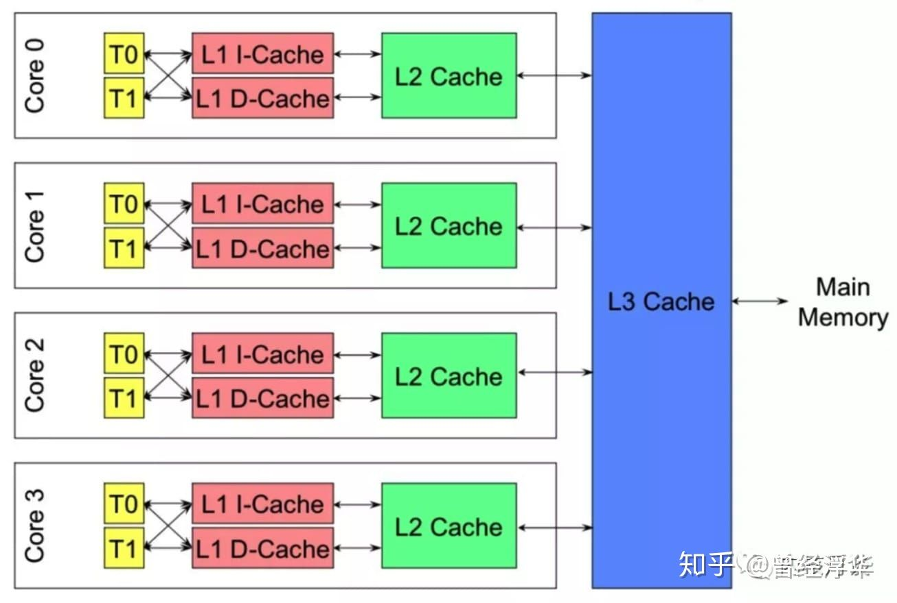

# 系统结构

## NUMA

<https://www.deafb.com/blog/numa%E6%9E%B6%E6%9E%84.html>

### 诞生背景

在NUMA出现之前，CPU朝着高频率的方向发展遇到了天花板，转而向着多核心的方向发展。

在一开始，内存控制器还在北桥中，所有CPU对内存的访问都要通过北桥来完成。此时所有CPU访问内存都是“一致的”。这样的架构称为**UMA(Uniform Memory Access)，直译为“统一内存访问”**

这样的架构对软件层面来说**非常容易**，总线模型保证所有的内存访问是一致的，即每个处理器核心共享相同的内存地址空间。**但随着CPU核心数的增加，这样的架构难免遇到问题，比如对总线的带宽带来挑战、访问同一块内存的冲突问题**。为了解决这些问题，有人搞出了NUMA。

### NUMA构架细节

NUMA 全称 Non-Uniform Memory Access，译为“非一致性内存访问”。这种构架下，不同的内存器件和CPU核心从属不同的 Node，每个 Node 都有自己的集成内存控制器（IMC，Integrated Memory Controller）。

在 Node 内部，架构类似SMP，使用 IMC Bus 进行不同核心间的通信；不同的 Node 间通过QPI（Quick Path Interconnect）进行通信，如下图所示：

一般来说，一**个内存插槽对应一个 Node**。需要注意的一个特点是，QPI的延迟要高于IMC Bus，也就是说CPU访问内存有了远近（remote/local）之别，而且实验分析来看，这个差别非常明显。

在Linux中，对于NUMA有以下几个需要注意的地方：

1. 默认情况下，内核不会将内存页面从一个 NUMA Node 迁移到另外一个 NUMA Node；
2. 但是有现成的工具可以实现将冷页面迁移到远程（Remote）的节点：NUMA Balancing；

关于不同 NUMA Node 上内存页面迁移的规则，社区中有依然有不少争论。

## Cache 一致性

高速缓存有时也称为CPU（中央处理器）内存，因为它通常**直接集成到 CPU 芯片中**或放置在与 CPU 具有单独总线互连的单独芯片上。因此，处理器更容易访问它，并且能够提高效率，因为它在物理上靠近处理器。

为了靠近处理器，高速缓存内存需要比**主内存小得多**。因此，它具有**较少的存储空间**。它也比主存储器**更昂贵**，因为它是一种更复杂的芯片，可以产生更高的性能。

每个内核**可以有专用的 L1 和 L2 缓存**，但它们可以共享 L3 缓存。如果 L3 缓存引用了一条指令，它通常会提升到更高级别的缓存。

假设多核CPU在每个CPU内不单独设置Cache，而是所有物理CPU共享一个Cache，这样全部CPU的读写操作均串行通过同一个Cache。这样，当其中一个CPU进行写操作，而另一个CPU进行读操作，总是能读到正确的值。
但是，所有CPU共享同一个Cache的设计，会**极大的降低系统的运算速度**，因为所有CPU均需要串行的访问Cache以获取数据，大部分时间均在等待Cache使用权。

常用的一致性协议有 **snooping 协议，也称为窥探协议**。

该协议对总线上的操作进行监听，例如：一个CPU_A，对变量X进行了写操作，但是还未回写到memory，而另外一个CPU_B需要读取变量X，这时如果直接从memory获取变量X的值，是过期值，而CPU_A能够从总线上窥探到该次读操作，把X值写入memory，而CPU_B的读操作由于未得到响应，其会重新发起读请求，这时就能从memory读取到最新值。

以上只是简单讲解，具体有 MESI 协议，其把Cache分为几个状态。

## I/O多路复用技术（multiplexing）

下面举一个例子，模拟一个tcp服务器处理30个客户socket。假设你是一个老师，让30个学生解答一道题目，然后检查学生做的是否正确，你有下面几个选择：

1. 第一种选择：按顺序逐个检查，先检查A，然后是B，之后是C、D。。。这中间如果有一个学生卡主，全班都会被耽误。这种模式就好比，你用循环挨个处理socket，根本不具有并发能力。
2. 第二种选择：你创建30个分身，每个分身检查一个学生的答案是否正确。 这种类似于为每一个用户创建一个进程或者线程处理连接。
3. 第三种选择，你站在讲台上等，谁解答完谁举手。这时C、D举手，表示他们解答问题完毕，你下去依次检查C、D的答案，然后继续回到讲台上等。此时E、A又举手，然后去处理E和A。。。

这种就是**IO复用模型**，Linux下的**select、poll和epoll就是干这个的**。**将用户socket对应的fd注册进epoll，然后epoll帮你监听哪些socket上有消息到达，这样就避免了大量的无用操作。此时的socket应该采用非阻塞模式。这样，整个过程只在调用select、poll、epoll这些调用的时候才会阻塞，收发客户消息是不会阻塞的，整个进程或者线程就被充分利用起来，这就是事件驱动，所谓的reactor模式**。
