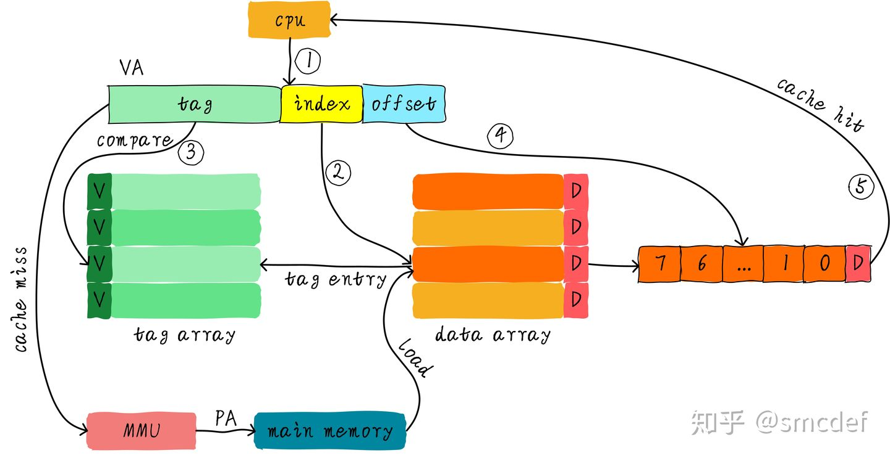
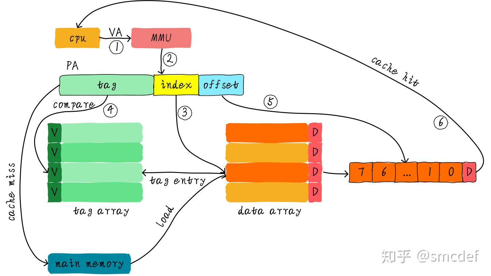
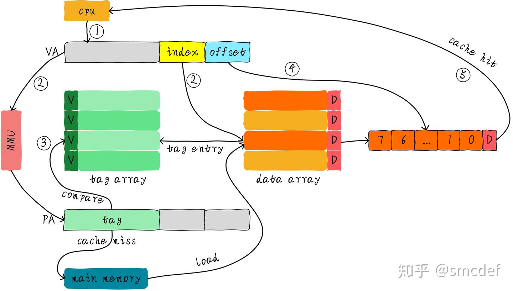

# 组成原理

## Cache

### 分类

<https://zhuanlan.zhihu.com/p/107096130>

**虚拟高速缓存(VIVT)**：这种cache硬件设计简单。在cache诞生之初，大部分的处理器都使用这种方式。虚拟高速缓存以虚拟地址作为查找对象

- 优点：虚拟高速缓存的优点是**不需要每次读取或者写入操作的时候把虚拟地址经过MMU转换为物理地址**，这在一定的程度上提升了访问cache的速度，毕竟MMU转换虚拟地址需要时间。同时硬件设计也更加简单。
- 缺点：主要会面临两个问题。歧义(ambiguity)和别名(alias)。为了保证系统的正确工作，**操作系统负责**避免出现歧义和别名。1）**歧义**：切换进程时，属于不同进程的数据具有相同的虚拟地址，导致命中同一个Cacheline，读到错误的数据。解决方法，切换进程时，刷新Cache，但开销大，新进程初始时，大量cpu miss。2）**别名**：当不同的虚拟地址映射相同的物理地址，而这些虚拟地址的index不同。**对应共享内存的情况**，同一个物理地址数据，在cache中两个缓存，对于采用写回策略，修改后，导致数据不一致。解决方法：nocache，共享内存不cache；针对直接映射高速缓存，并且使用了写分配机制有效。在建立共享数据映射时，保证每次分配的虚拟地址都索引到相同的cacheline（内存是按页对齐管理的，使用低12位作为index，就能让同一个物理地址，即使有不同的虚拟地址，index还是相同的）

**物理高速缓存(PIPT)**：tag和index都取自物理地址

1. 有点，每个物理内存的cacheline都是独一无二的，不会出现歧义和别名的问题。**这是PIPT最大的优点**。现在的CPU很多都是采用PIPT高速缓存设计
2. 缺点是，CPU访存都需要先经过MMU进行地址转换，效率不高。

**物理标记的虚拟高速缓存(VIPT)**：为了提升cache查找性能，**我们不想等到虚拟地址转换物理地址完成后才能查找cache**。因此，我们可以使用虚拟地址对应的index位查找cache，与此同时(硬件上同时进行)将虚拟地址发到MMU转换成物理地址。当MMU转换完成，同时cache控制器也查找完成，此时比较cacheline对应的tag和物理地址tag域，以此判断是否命中cache。

1. 优点：查找cache和MMU转换虚拟地址同时进行，所以**性能上有所提升**；VIPT以物理地址部分位作为tag，因此我们**不会存在歧义问题**。但是，采用虚拟地址作为index，所以**可能**依然存在别名问题（针对直接映射高速缓存，如果cache的size小于等于4KB，采用物理地址的位<11...0>某一段作为index，则虚拟地址和物理地址对应的index都是一样的，不存在别名）
2. 可能出现的别名问题：

假设系统使用的是直接映射高速缓存，cache大小是8KB，cacheline大小是256字节。这种情况下的VIPT就存在别名问题。因为index来自虚拟地址位<12...8>，虚拟地址和物理地址的位<11...8>是一样的，但是bit12却不一定相等。 假设虚拟地址0x0000和虚拟地址0x1000都映射相同的物理地址0x4000。那么程序读取0x0000时，系统将会从物理地址0x4000的数据加载到第0x00行cacheline。然后程序读取0x1000数据，再次把物理地址0x4000的数据加载到第0x10行cacheline。这不，别名出现了。相同物理地址的数据被加载到不同cacheline中。

出现别名的根本原因是，虚拟地址的index不等于物理地址的index，导致同一个物理地址在cache中具有两个副本。

解决办法：

因此，在建立共享映射的时候，返回的虚拟地址都是按照cache大小对齐的地址，这样就没问题了。如果是多路组相连高速缓存的话，**返回的虚拟地址必须是满足一路cache大小对齐**。在Linux的实现中，就是通过这种方法解决别名问题。对齐后，保证虚拟index等于物理index，这样都映射到同一路，再通过物理的tag，就能唯一对应一个cacheline。

### 小结

VIVT Cache问题太多，软件维护成本过高，是最难管理的高速缓存。所以现在基本只存在历史的文章中。**现在我们基本看不到硬件还在使用这种方式的cache。现在使用的方式是PIPT或者VIPT**。==如果多路组相连高速缓存的一路的大小小于等于4KB，一般硬件采用VIPT方式，因为这样相当于PIPT，岂不美哉==。当然，如果一路大小大于4KB，一般采用PIPT方式，也不排除VIPT方式，这就需要操作系统多操点心了。

## 待看

<https://blog.csdn.net/qq_35812205/article/details/104526406>
