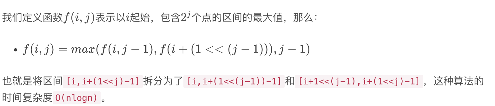

# RMQ 与 LCA 问题

<https://blog.csdn.net/qq_17550379/article/details/104314667>

## 一维

**RMQ (Range Minimum/Maximum Query)**问题是指：对于长度为n nn的数列A AA，回答若干询问 RMQ(A,i,j)(i,j<=n)，返回数列 A 中下标在 i, j 里的最小(大）值，也就是说，RMQ​问题是指求区间最值的问题。



```cpp
const int MAXN = 50010;
int dp[MAXN][20];
int mm[MAXN];  // 存储对数
//初始化RMQ, b 数组下标从1 开始，从0 开始简单修改
void initRMQ(int n, int b[])
{
    mm[0] = −1;
    for (int i = 1; i <= n; i++)
    {
        mm[i] = ((i & (i − 1)) == 0) ? mm[i − 1] + 1: mm[i − 1];
        dp[i][0] = b[i];
    }

    for (int j = 1; j <= mm[n]; j++)
        for (int i = 1; i + (1 << j) − 1 <= n; i++)
            dp[i][j] = max(dp[i][j − 1], dp[i + (1 << (j − 1))][j − 1]);
}
//查询最大值
int rmq(int x, int y)
{
    int k = mm[y − x + 1];
    return max(dp[x][k], dp[y − (1 << k) + 1][k]);
}
```

## 二维

```cpp
int val[310][310];
int dp[310][310][9][9];//最大值
int mm[310];//二进制位数减一，使用前初始化
void initRMQ(int n, int m)
{
    for (int i = 1; i <= n; i++)
        for (int j = 1; j <= m; j++)
            dp[i][j][0][0] = val[i][j];

    for (int ii = 0; ii <= mm[n]; ii++)
    {
        for (int jj = 0; jj <= mm[m]; jj++)
        {
            if (ii + jj)
            {
                for (int i = 1; i + (1 << ii) − 1 <= n; i++)
                {
                    for (int j = 1; j + (1 << jj) − 1 <= m; j++)
                    {
                        if (ii) dp[i][j][ii][jj] = max(dp[i][j][ii − 1][jj], dp[i + (1 << (ii − 1))][j][ii − 1][jj]);
                        else dp[i][j][ii][jj] = max(dp[i][j][ii][jj − 1], dp[i][j + (1 << (jj − 1))][ii][jj − 1]);
                    }
                }
            }
        }
    }
}
//查询矩形内的最大值(x1 <= x2,y1 <= y2)
int rmq(int x1, int y1, int x2, int y2)
{
    int k1 = mm[x2 − x1 + 1];
    int k2 = mm[y2 − y1 + 1];
    x2 = x2 − (1 << k1) + 1;
    y2 = y2 − (1 << k2) + 1;
    return max({dp[x1][y1][k1][k2], dp[x1][y2][k1][k2], dp[x2][y1][k1][k2], dp[x2][y2][k1][k2]});
}
```

## LCA 最近公共祖先问题

<https://blog.csdn.net/jeryjeryjery/article/details/52862352>
