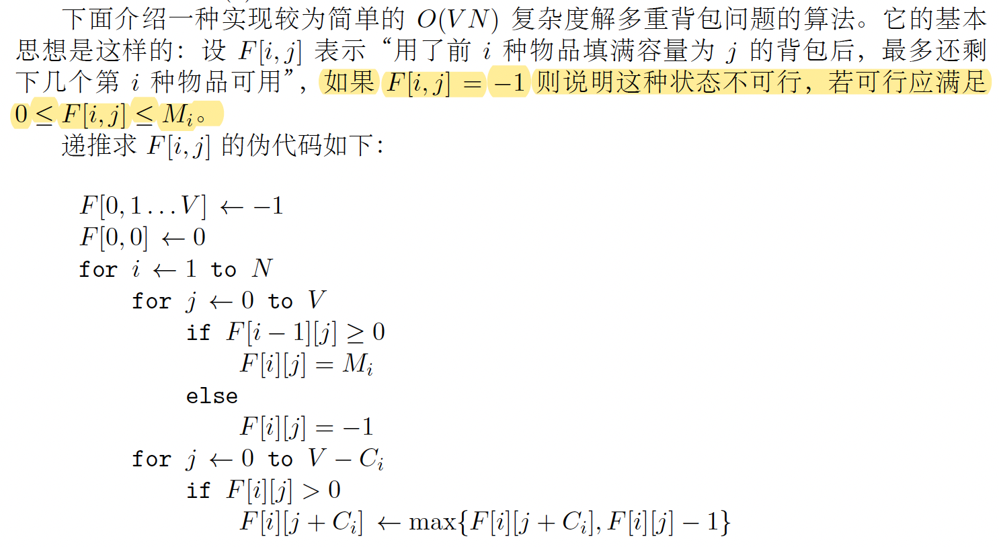

# 动态规划

- [记忆化搜索](#记忆化搜索)
- [线性 DP](#线性-dp)
- [树状dp](#树状dp)
- [1. 背包问题](#1-背包问题)
  - [1.1. 01 背包问题](#11-01-背包问题)
  - [1.2. 完全背包问题](#12-完全背包问题)
  - [1.3. 多重背包问题](#13-多重背包问题)
    - [1.3.1. 可行性](#131-可行性)
  - [1.4. 混合三种背包问题](#14-混合三种背包问题)
  - [1.5. 二维费用的背包问题](#15-二维费用的背包问题)
  - [1.6. 分组的背包问题](#16-分组的背包问题)
  - [1.7. 有依赖的背包问题](#17-有依赖的背包问题)
  - [1.8. 背包问题问法的变化](#18-背包问题问法的变化)

注意点：

1. 当使用dp算法超时时，赶紧考虑贪心算法

<https://maomaoalgo.gitbook.io/python/hui-su-yu-dong-tai-gui-hua/dai-ji-yi-de-dfs-zhuang-tai-ya-suo>

## 记忆化搜索

讨论：动态规划（DP）与记忆化搜索（Memoization）的优劣比较：
记忆化搜索最大的优点：

1. **容易编写**，不需要注意转移顺序，比如区间DP中要先枚举长度避免overwrite状态，也不用注意要先declare足够的数组空间。
2. **在有些情况下可以减少访问的状态**。相比之下动态规划一般需要访问所有的子问题。这一点一般情况下区别不大，因为两者相比时间复杂度都是相似的。

记忆化搜索最大的缺点

1. 因为迭代调用函数，常规时间常数可能较大
2. 不能用滚动数组来优化空间。

在算法思维上，**DP和贪心与分治**都很相似。然而DP的特点是它具有：

1. 最优子结构：通过遍历子问题的答案，做出最优选择。其中子问题没有共享资源(no shared resources between subproblems)。因为要遍历所有子问题才能找到最后答案，这点区别于贪心。
2. 重叠子问题：在遍历子问题的过程中，没有产生新的问题（not generating new problems）。这点区别于分治。

## 线性 DP


[打家劫舍](https://leetcode-cn.com/problems/house-robber/)简单版定义一个一维数组即可，dp[i] 只跟dp[i-1]和dp[i-2]有关，因此只需要使用两个变量保存；

上述的解法中，定义二维数组，**为每个dp[i]定义了多机种状态**，这种思维在更复杂的情况下是值得参考。

```cpp
    int robRange(vector<int>& nums, int start, int end) {
        int first = nums[start], second = max(nums[start], nums[start + 1]);
        for (int i = start + 2; i <= end; i++) {
            int temp = second;
            second = max(first + nums[i], second);
            first = temp;
        }
        return second;
    }
```

## 树状dp

先算出每个子树的结果（各种情况的），在递推出当前树

<https://leetcode-cn.com/problems/house-robber-iii/>

## 1. 背包问题

<https://maomaoalgo.gitbook.io/python/hui-su-yu-dong-tai-gui-hua/bei-bao-dp>

背包问题（Knapsack Problem）描述的是有容量约束的情况下，求考虑了所有物品（大小价值各异）之后的最优解或解的个数。

两种基本的背包问题：

1. 0-1背包：每个物品只能拿一次
2. 完全背包：每个物品能拿无限次

详情看pdf

### 1.1. 01 背包问题


### 1.2. 完全背包问题


注意：完全背包问题, 如果是求**最值**，两层循环可以互换，看情况选择。但是，如果是计算**方案数**，注意题目要求是否考虑方案的顺序，如果考虑，则应该**把容量循环放在最外层**。

### 1.3. 多重背包问题


#### 1.3.1. 可行性

**每种有若干件的物品是否填满给定容量的背包**



### 1.4. 混合三种背包问题


### 1.5. 二维费用的背包问题


### 1.6. 分组的背包问题


### 1.7. 有依赖的背包问题


### 1.8. 背包问题问法的变化
