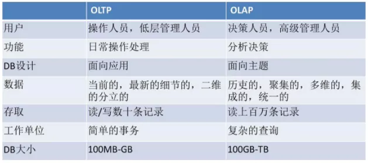
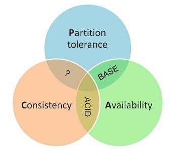
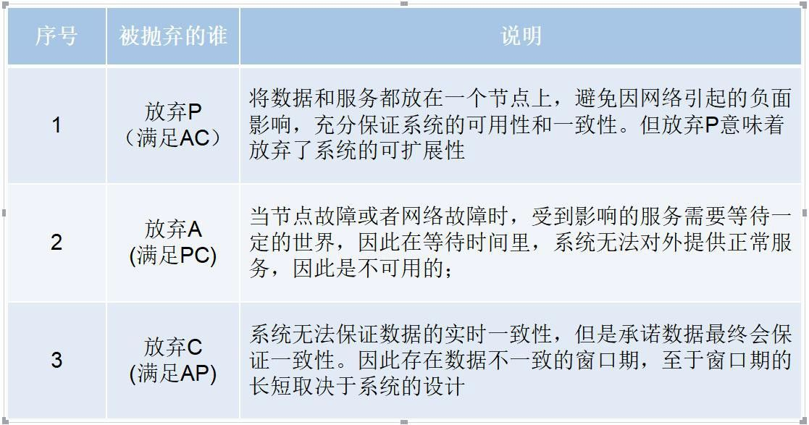

# 分布式数据库

- [1. OLTP与OLAP](#1-oltp与olap)
  - [1.1. OLTP](#11-oltp)
  - [1.2. OLAP](#12-olap)
- [2. 非关系型数据库](#2-非关系型数据库)
  - [2.1. 非关系型数据库和关系型数据库区别，优势比较？](#21-非关系型数据库和关系型数据库区别优势比较)
- [3. 分布式](#3-分布式)
  - [3.1. CAP](#31-cap)
- [raft & paxos](#raft--paxos)
- [4. 事务](#4-事务)
  - [4.1. 四大特性 ACID](#41-四大特性-acid)

## 1. OLTP与OLAP

<https://www.51cto.com/article/649855.html>

数据处理大致可以分成两大类：

1. 联机事务处理OLTP(On-line transaction processing)
2. 联机分析处理OLAP(On-Line Analytical Processing)

OLTP是传统的**关系型数据库的主要应用**，**主要是基本的、日常的事务处理，例如银行交易**。
OLAP是**数据仓库系统的主要应用**，支持复杂的分析操作，侧重决策支持，并且提供直观易懂的查询结果。

相同点：IO类型都是随机的，读多写少
不同点：OLAP的读操作更多，大I/O、批处理多，一般用带宽衡量；OLTP则小I/O较多，一个事务一个事务执行，主要衡量指标是IOPS。

|  | OLTP | OLAP |
| -- | -- | -- |
| IO类型 | 随机，读多写少 | 随机，读多写少，写几乎没有，顺序读较多 |
| IO大小 | 小IO | 大IO，大量读 |
| 业务特征 | 多人在线，几千上万事务并发 | 在线/离线，用户少，一个查询将花费数小时，甚至数天 |
| 瓶颈 | 服务器的CPU, 存储系统IOPS处理能力 | 存储系统的带宽, **CACHE基本是没有效果的** |

在实际应用中，既然OLTP中存放了大量的细节数据，**为什么不直接在OLTP上进行分析处理呢**?

由于OLTP主要是为了操作数据而设计(操作系统)，用于处理已知的任务和负载：常见的优化在于主码索引和散列，检索特定的记录。去优化某一些特定的查询语句。

而OLAP则是为了分析数据而设计(数据仓库)，其查询的方式往往是复杂且未知的，通常会涉及大量数据在汇总后的计算，这种需要基于多维视图的数据操作在OLTP上执行的时候性能将是非常差的，并且是也是极其危险的。

但是OLAP系统数据来源与各种OLTP数据库。因为OLTP系统存储的数据往往是异质的，所以**OLAP系统需要把各种来源于OLTP的异质数据通过转换(ETL)做到同质并且合并**。

### 1.1. OLTP

OLTP通常是指事务性非常高的在线系统，以小的事务以及小的查询为主；单个数据库每秒处理的Transaction往往超过几百个，或者是几千个，Select语句的执行量每秒几千甚至几万个。典型的OLTP系统有**电子商务系统、银行、证券**等：

1. 每个I/O非常小，通常为2KB~8KB
2. 访问磁盘数据的位置非常随机
3. 至少30%的数据是随机写操作
4. 联机重做日志是写入非常频繁的顺序写

**业务特征**：每个事务的读，写，更改涉及的数据量非常小，同时有**很多用户连接**到数据库，使用数据库，要求数据库有很快的响应时间，通常一个事务在几秒内完成，时延要求一般在10-20ms。

OLTP系统最容易出现瓶颈的地方除了**服务器的CPU，就是存储系统IOPS处理能力**

### 1.2. OLAP

绝大多数时候数据库上运行着的是报表作业，执行基本上是聚合类的SQL 操作，比如Group by，同时扫描非常多的行，一个查询将花费数小时，甚至数天，一次读取的数据量大;一般无数据修改，或者只有非常少的数据修改：

1. 单个I/O很大，典型的值为64KB~1MB
2. 读取操作为顺序读取
3. 当读取操作进行时，发生的写操作通常在临时表空间内
4. 平常对在线日志写入很少，除非在批量加载数据时

1、业务特征：一般**很少有数据修改**，除非在批量加载数据时;系统调用**非常复杂的查询语句**，同时扫描非常多的行;一个查询将花费数小时，甚至数天;主要取决于查询语句的复杂程度;查询的输出通常是一个统计值，由group by与order by得出;当读取操作进行时，**发生的写操作通常在临时表空间内**;平常对在线日志写入很少，除非在批量加载数据时;分析型业务，一般对时延没有要求。

OLTP系统最容易出现瓶颈的地方是**存储系统的带宽**。阵列的带宽则往往取决于主机到阵列的前端网络和后端硬盘的个数，这个时候，**阵列CACHE基本是没有效果的**，数据库的读写类型基本上是db file scattered read与direct path read/write。

## 2. 非关系型数据库

### 2.1. 非关系型数据库和关系型数据库区别，优势比较？

首先一般非关系型数据库是基于CAP模型，而传统的关系型数据库是基于ACID模型的

1. **数据存储结构**：关系型数据库一般都有固定的**表结构**，并且需要通过**DDL语句**来修改表结构，不是很容易进行扩展；而非关系型数据库的存储机制就有很多，比如基于**文档的，K-V键值对的，还有基于图的**等，对于数据的格式**十分灵活没有固定的表结构**，**方便扩展**，因此如果业务的==数据结构并不是固定的或者经常变动比较大的==，那么非关系型数据库是个好的选择
2. **可扩展性**。传统的关系型数据库给人一种**横向扩展难，不好对数据进行分片**等，而一些非关系型数据库则**原生就支持数据的水平扩展**(比如mongodb的sharding机制)
3. **性能/易用性**上，在某些特定的应用场景，NoSQL性能更高，比如KV；但SQL，可以使用各种SQL语句进行复杂的操作，在易用性和便捷性上更具有优势

## 3. 分布式

### 3.1. CAP

<https://zhuanlan.zhihu.com/p/33999708>
<https://www.zhihu.com/question/309582890>

指的是在一个分布式系统中，一致性（Consistency）、可用性（Availability）、分区容错性（Partition tolerance）。**CAP 原则指的是，这三个要素最多只能同时实现两点，不可能三者兼顾**

#### 3.1.1. Consistency 一致性

**在分布式系统中的所有数据备份，在同一时刻是否同样的值**。所有节点在同一时间的看到的数据完全一致

从客户端角度，多进程并发访问时，更新过的数据在不同进程如何获取的不同策略，决定了不同的一致性。

**强一致性**
对于关系型数据库，要求更新过的数据能被后续的访问都能看到，这是强一致性。

**弱一致性**
如果能容忍后续的**部分或者全部访问不到**，则是弱一致性。

**最终一致性**
如果经过**一段时间后**要求能访问到更新后的数据，则是最终一致性。

#### Availability 可用性

可用性指“Reads and writes always succeed”，即服务在正常响应时间内一直可用。

好的可用性主要是指系统能够很好的为用户服务，不出现用户操作失败或者**访问超时**等用户体验不好的情况。**可用性通常情况下可用性和分布式数据冗余，负载均衡等有着很大的关联**。

#### Partition Tolerance 分区容错性

分布式系统在遇到某节点或网络分区故障的时候，仍然能够对外提供满足一致性或可用性的服务。

## raft & paxos

直接背好了，性能较低（2RTT），复杂，难以理解，实现困难，没有强的主副本；优化版有MultiPaxos，性能减低到 1RTT；但还是实现困难。

raft只读优化：<https://zhuanlan.zhihu.com/p/104651506>

## 4. 事务

<http://ddia.vonng.com/#/ch7>

事务中的所有读写操作被视作**单个操作**来执行：整个事务要么成功 **提交（commit）**，要么失败 **中止（abort）** 或 **回滚（rollback）**

### 4.1. 四大特性 ACID

事务的四大特性分别是：原子性、一致性、隔离性、持久性

