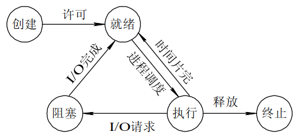
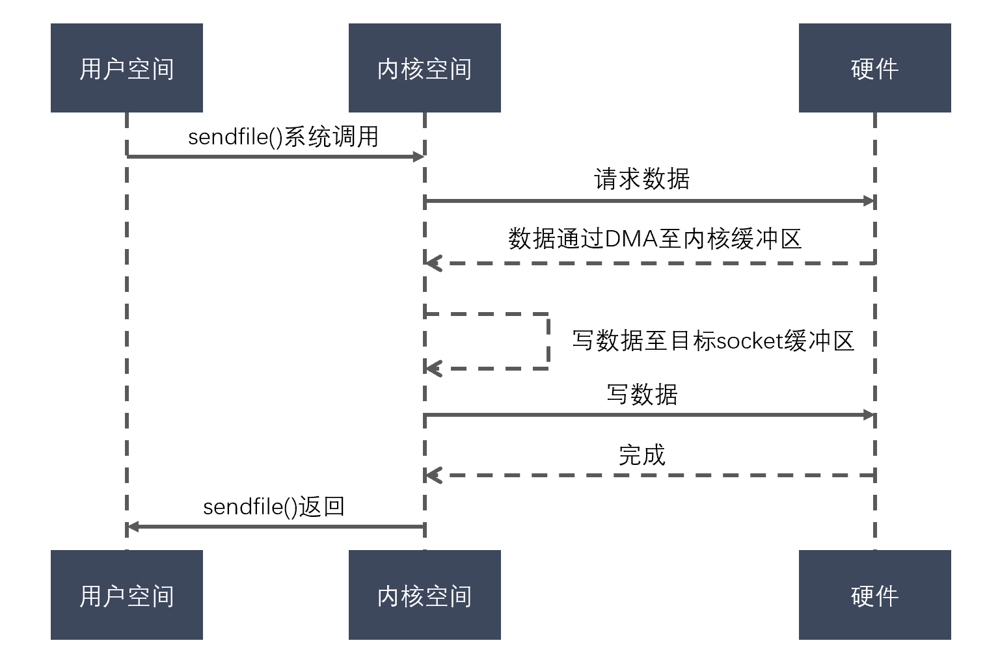
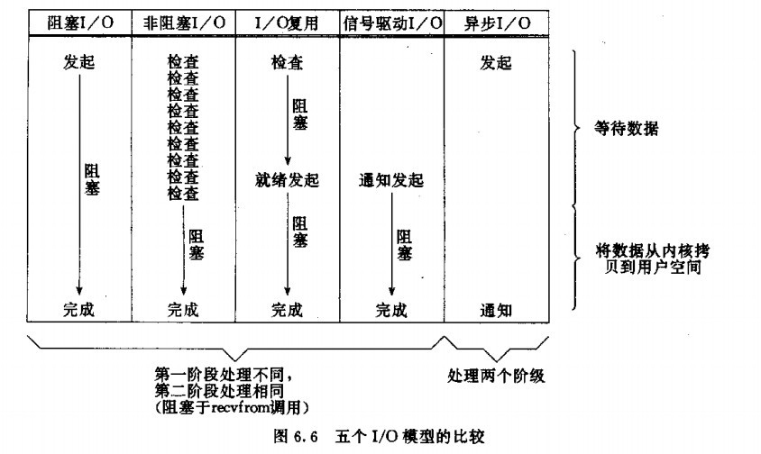

# 操作系统2

- [1. 请你说说什么是孤儿进程，什么是僵尸进程，如何解决僵尸进程](#1-请你说说什么是孤儿进程什么是僵尸进程如何解决僵尸进程)
- [2. 创建守护进程](#2-创建守护进程)
- [3. 说说进程通信的方式有哪些？](#3-说说进程通信的方式有哪些)
- [4. 进程同步的方式](#4-进程同步的方式)
- [5. Linux进程调度算法及策略有哪些](#5-linux进程调度算法及策略有哪些)
- [6. 进程/线程有多少种状态](#6-进程线程有多少种状态)
  - [6.1. 进程状态转移](#61-进程状态转移)
  - [6.2. 线程状态转移](#62-线程状态转移)
- [7. 管道/消息队列实现原理是什么](#7-管道消息队列实现原理是什么)
  - [7.1. 管道](#71-管道)
  - [7.2. 消息队列](#72-消息队列)
  - [7.3. 应用场景](#73-应用场景)
- [8. 线程间的通信方式](#8-线程间的通信方式)
- [9. 简述mmap的原理和使用场景](#9-简述mmap的原理和使用场景)
- [10. 死锁](#10-死锁)
- [11. 信号量机制](#11-信号量机制)
- [12. 简述自旋锁和互斥锁的使用场景](#12-简述自旋锁和互斥锁的使用场景)
- [13. 说说sleep和wait的区别？](#13-说说sleep和wait的区别)
- [14. 零拷贝技术（zero-copy）](#14-零拷贝技术zero-copy)
- [15. 直接I/O和缓存I/O](#15-直接io和缓存io)
  - [15.1. 缓存IO](#151-缓存io)
  - [15.2. 直接IO](#152-直接io)
- [16. IO 模型](#16-io-模型)
  - [16.1. 阻塞IO](#161-阻塞io)
  - [16.2. 非阻塞IO](#162-非阻塞io)
  - [16.3. IO多路复用](#163-io多路复用)
  - [16.4. 信号驱动IO](#164-信号驱动io)
  - [16.5. 异步IO](#165-异步io)
  - [16.6. 总结](#166-总结)
- [17. read()和recv()以及send()和write()区别](#17-read和recv以及send和write区别)
- [18. I/O 多路复用](#18-io-多路复用)
  - [18.1. 背景](#181-背景)
  - [18.2. 原理](#182-原理)
  - [应用场景](#应用场景)
  - [18.3. select](#183-select)
  - [18.4. poll](#184-poll)
  - [18.5. epoll](#185-epoll)
- [19. 不同IO多路复用方案优缺点](#19-不同io多路复用方案优缺点)
  - [19.1. 小结](#191-小结)
  - [19.2. epoll为什么高效](#192-epoll为什么高效)
- [说说Reactor、Proactor模式](#说说reactorproactor模式)

## 1. 请你说说什么是孤儿进程，什么是僵尸进程，如何解决僵尸进程

**孤儿进程**：是指一个父进程退出后，而它的一个或多个子进程还在运行，那么这些子进程将成为孤儿进程。孤儿进程将被init进程（进程号为1）所收养，并且由init进程对它们完整状态收集工作。

**僵尸进程**：是指一个进程使用fork函数创建子进程，如果子进程退出，而父进程并没有调用wait()或者waitpid()系统调用取得子进程的终止状态，那么子进程的进程描述符仍然保存在系统中，占用系统资源，这种进程称为僵尸进程。

**如何解决僵尸进程：**

（1）一般，为了防止产生僵尸进程，在fork子进程之后我们都要及时使用wait系统调用；同时，当子进程退出的时候，内核都会给父进程一个SIGCHLD信号，所以我们可以建立一个捕获SIGCHLD信号的信号处理函数，在函数体中调用wait（或waitpid），就可以清理退出的子进程以达到防止僵尸进程的目的。

（2）使用kill命令。

## 2. 创建守护进程

守护进程：守护进程是运行在后台的一种生存期长的特殊进程。它**独立于控制终端**，处理一些系统级别任务。

如何实现：
（1）创建子进程，终止父进程。方法是调用fork() 产生一个子进程，然后使父进程退出。
（2）子进程，**调用setsid() 创建一个新会话session**。
（3）将当前目录更改为根目录。使用fork() 创建的子进程也继承了父进程的当前工作目录。
（4）重设文件权限掩码。文件权限掩码是指屏蔽掉文件权限中的对应位。
（5）关闭不再需要的文件描述符。子进程从父进程继承打开的文件描述符。

setsid();
说明：当进程是会话的领头进程时setsid()调用失败并返回（-1）。setsid()调用成功后，返回新的会话的ID，调用setsid函数的进程成为新的会话的**领头进程**，并**与其父进程的会话组 和 进程组脱离。由于会话对控制终端的独占性，进程同时与控制终端脱离**。

- 让进程摆脱原会话的控制
- 让进程摆脱原进程组的控制
- 让进程摆脱原控制终端的控制

## 3. 说说进程通信的方式有哪些？

进程间通信主要包括**管道**、**系统IPC**（包括消息队列、信号量、信号、共享内存）、套接字socket

1. **管道**：包括无名管道和命名管道，无名管道半双工，只能用于具有亲缘关系的进程直接的通信（父子进程或者兄弟进程），可以看作一种特殊的文件（虚拟的IO设备）；命名管道可以允许无亲缘关系进程间的通信。
2. 系统IPC（操作系统提供的进程间通信方式）
   1. 消息队列：消息的链接表，放在内核中。**消息队列独立于发送与接收进程，进程终止时，消息队列及其内容并不会被删除**；消息队列可以实现消息的随机查询，可以按照消息的类型读取。
   2. 信号量semaphore：是一个计数器，可以用来控制多个进程对共享资源的访问。信号量用于实现进程间的互斥与同步。
   3. 信号：用于通知接收进程某个事件的发生。
   4. 内存共享：使多个进程访问同一块内存空间。
3. 套接字socket：用于不同主机直接的通信。

消息队列和管道的不同：

1. 管道通信方式的**中间介质类似于文件，通常称这种文件为管道文件（虚拟I/O设备）**，读出来的是**字节**，没有特殊的格式含义，程序员的工作量大；消息通信方式以**消息缓冲区**为中间介质，通信双方的发送和接收操作均以**消息为单位**，有特定的格式。在存储器中，消息缓冲区被组织成队列，通常称之为消息队列
2. 管道一般用于父子进程间通信（有名管道除外，有名管道不限于父子进程通信）。而消息队列可用于你机器上的任何进程间通信（只要进程有权操作消息队列）。
3. 但消息队列是随内核持续的，与有名管道（随进程持续）相比，生命力更强，应用空间更大。
4. 管道一经生成后，任务之间就可以使用标准I/O操作主要是read()和write()进行通信。**管道的优点在于它是一个I/O设备，与标准的VxWorks I/O一样，可以使用select机制**，而有了select机制，一个任务很方便地使用多个异步I/O设备，如任务要处理同时从串口、管道、socket接收到的数据，就可以使用select。

## 4. 进程同步的方式

> 和通信方式类似

1. 信号量semaphore：是一个计数器，可以用来控制多个进程对共享资源的访问。信号量用于实现进程间的互斥与同步。P操作(递减操作)可以用于阻塞一个进程，V操作(增加操作)可以用于解除阻塞一个进程。
2. 管道：一个进程通过调用管程的一个过程进入管程。在任何时候，只能有一个进程在管程中执行，调用管程的任何其他进程都被阻塞，以等待管程可用。
3. 消息队列：消息的链接表，放在内核中。消息队列独立于发送与接收进程，进程终止时，消息队列及其内容并不会被删除；消息队列可以实现消息的随机查询，可以按照消息的类型读取。

## 5. Linux进程调度算法及策略有哪些

- 先来先服务调度算法
- 短作业(进程)优先调度算法
- 高优先级优先调度算法
- 时间片轮转法
- 多级反馈队列调度算法

## 6. 进程/线程有多少种状态

### 6.1. 进程状态转移

创建、就绪、执行、阻塞、终止

一个进程创建后，被放入队列处于就绪状态，等待操作系统调度执行，执行过程中可能切换到阻塞状态（并发），任务完成后，进程销毁终止。



### 6.2. 线程状态转移


## 7. 管道/消息队列实现原理是什么

<https://www.cnblogs.com/xiaolincoding/p/13402297.html>

### 7.1. 管道

操作系统在**内核中**开辟一块**缓冲区（称为管道）**用于通信。管道是一种两个进程间进行单向通信的机制。因为这种**单向性**，管道又称为**半双工管道**，所以其使用是有一定的局限性的。半双工是指数据只能由一个进程流向另一个进程（一个管道负责读，一个管道负责写）；如果是全双工通信，需要建立两个管道。管道分为无名管道和命名管道，无名管道只能用于具有亲缘关系的进程直接的通信（父子进程或者兄弟进程），可以看作一种特殊的文件，**管道本质是一种文件**；命名管道可以允许无亲缘关系进程间的通信。

如果试图从管道写端读取数据，或者向管道读端写入数据都将发生错误。一般文件的 I/O 函数都可以用于管道，如close()、read()、write()等。管道满，写会阻塞；管道空，读会阻塞

避免通信混淆：
父进程关闭读取的 fd[0]，只保留写入的 fd[1]；
子进程关闭写入的 fd[1]，只保留读取的 fd[0]；

```shell
$ ps auxf | grep mysql
```

上面命令行里的「|」竖线就是一个管道，它的功能是将前一个命令（ps auxf）的输出，作为后一个命令（grep mysql）的输入

PIPE是一种**非永久性的管道通信机构**，当它访问的进程全部终止时，它也将随之被撤消；它也不能用于不同族系的进程之间的通信。而**FIFO是一种永久的管道通信机构，它可以弥补PIPE的不足**。

注意，这个匿名管道是特殊的文件，只存在于内存，不存于文件系统中。

**可以将通道的长度设置为0，实现发送方和接收方同步的通信方式**

### 7.2. 消息队列

消息队列是：**单向** **固定数量的条目** **每个条目都有一个最大尺寸** 创建时分配的所有队列内存（＃entries *条目大小） 类似数据报的行为：读取条目会将其从队列中删除。如果您没有读取整个数据，则其余数据将丢失。例如：发送一个20字节的消息，但接收器读取10个字节。剩下的10个字节丢失了。 任务只能使用msqQReceive在单个队列上挂起（有方法可以使用备用API更改它） 发送时，如果队列已满，您将挂起（并且您没有执行NO_WAIT） 接收时，如果队列为空（并且您没有执行NO_WAIT），您将挂起 接收和发送支持超时

消息队列是保存在内核中的**消息链表**

### 7.3. 应用场景

1. **信号量使用方便，可以解决很多任务间的协调问题，但是信号量所传递的信息有限**，而内存共享虽然传递信息可以大些，但是不标准。消息队列作为一种折忠方式用于线程之间的信息交换。**信号量使用进程间的协调同步控制，通常配合共享内存使用**。

- 一个是 P 操作，这个操作会把信号量减去 -1，相减后如果信号量 < 0，则表明资源已被占用，进程需阻塞等待；相减后如果信号量 >= 0，则表明还有资源可使用，进程可正常继续执行。
- 另一个是 V 操作，这个操作会把信号量加上 1，相加后如果信号量 <= 0，则表明当前有阻塞中的进程，于是会将该进程唤醒运行；相加后如果信号量 > 0，则表明当前没有阻塞中的进程；

**互斥模式**：信号初始化为 1，就代表着是互斥信号量，它可以保证共享内存在任何时刻只有一个进程在访问，这就很好的保护了共享内存。

**生产者消费者模式**：信号初始化为 0，生产者负责V，消费者负责P。

2. 消息队列允许许多的消息排队，而每个信息可以有不同长度，而传统管道中的数据仅仅是一个数据流，没有边界。Vxworks中的管道数据有消息组成。消息队列使用更广，**不随着进程的终止而销毁，生命周期长**，多用与任何进程的通信。但消息通信方式存在不足的地方有两点，一是**通信不及时**，二是**附件也有大小限制**。消息队列**不适合传递比较大的数据**

3. 通道，比如PIPE一般用于父子进程的通信，FIFO则拥有和消息队列类似的优点，只是传递的内容是**无格式**的。**使用数据流传输**。先进先出，不能任意寻址。

不过都存在**用户态与内核态之间的数据拷贝开销**，因为进程写入数据到内核中的消息队列时，会发生从用户态拷贝数据到内核态的过程，同理另一进程读取内核中的消息数据时，会发生从内核态拷贝数据到用户态的过程。还有模式切换的开销。

4. 共享内存的方式避免了数据拷贝，适合大数据传输。

共享内存的机制，就是拿出一块虚拟地址空间来，映射到相同的物理内存中。这样这个进程写入的东西，另外一个进程马上就能看到了，都不需要拷贝来拷贝去，传来传去，大大提高了进程间通信的速度。

5. 信号

上面说的进程间通信，都是常规状态下的工作模式

对于异常情况下的工作模式，就需要用「信号」的方式来通知进程。**信号主要用于进程的控制**，比如终止SIGINT，暂停SIGTSTP等。采用**异步通信机制**。

6. Socket

上述的方式都是同一台主机上进行进程间通信。那要想**跨网络与不同主机上的进程之间通信**，就需要 Socket 通信了。当然也可以用于同一主机的进程间通信。

本地字节流 socket 和 本地数据报 socket 在 bind 的时候，不像 TCP 和 UDP 要绑定 IP 地址和端口，**而是绑定一个本地文件**，这也就是它们之间的最大区别。

## 8. 线程间的通信方式

线程间的通信方式包括**临界区**、**互斥量**、**信号量**、**条件变量**、**读写锁**：

1. 临界区：每个线程中访问临界资源的那段代码称为临界区（Critical Section）（临界资源是一次仅允许一个线程使用的共享资源）。每次只准许一个线程进入临界区，进入后不允许其他线程进入。不论是硬件临界资源，还是软件临界资源，多个线程必须互斥地对它进行访问。
2. **互斥量**：采用互斥对象机制，只有拥有互斥对象的线程才可以访问。因为互斥对象只有一个，所以可以保证公共资源不会被多个线程同时访问。
3. **信号量**：计数器，允许多个线程同时访问同一个资源。
4. **条件变量**：通过条件变量通知操作的方式来保持多线程同步。
5. **读写锁**：读写锁与互斥量类似。但互斥量要么是锁住状态，要么就是不加锁状态。读写锁一次只允许一个线程写，但允许一次多个线程读，这样效率就比互斥锁要高。

## 9. 简述mmap的原理和使用场景

mmap是一种**内存映射文件**的方法，即将一个**文件或者其它对象**映射到进程的地址空间，实现文件磁盘地址和进程虚拟地址空间中一段虚拟地址的**一一对映关系**。实现这样的映射关系后，进程就可以采用**指针的方式**读写操作这一段内存，而系统会自动回写脏页面到对应的文件磁盘上，即完成了对文件的操作而**不必再调用read, write等系统调用函数**。相反，内核空间对这段区域的修改也直接反映用户空间，从而可以实现不同进程间的文件共享。

使用场景：

- 对同一块区域**频繁读写**操作；
- 可用于实现用户空间和内核空间的**高效交互**
- 可提供进程间**共享内存及相互通信**
- 可实现高效的**大规模数据传输**。

## 10. 死锁

死锁: 是指**多个进程**在执行过程中，因**争夺资**源而造成了**互相等待**。此时系统产生了死锁。比如两只羊过独木桥，若两只羊互不相让，争着过桥，就产生死锁。

产生的条件；（1）互斥条件；（2）请求保持条件（3）不可剥夺条件；（4）环路等待条件

如何解决：

（1）资源一次性分配，从而解决请求保持的问题
（2）可剥夺资源：当进程新的资源未得到满足时，释放已有的资源；
（3）资源有序分配：资源按序号递增，进程请求按递增请求，释放则相反。

## 11. 信号量机制

<https://blog.csdn.net/qq_43291837/article/details/82865151>

1） 整型信号量

信号量定义为一个整型量；根据初始情况赋相应的值；仅能通过两个原子操作来访问。

**P操作 wait(S)**:
While S<=0 do no-op;
S:=S-1;

**V操作 signal(S)**:
S:=S+1;

整型信号量**符合“有限等待”原则**
signal释放资源后，当CPU被分配给等待进程后，等待进程仍可继续执行，可以符合“有限等待”。

**问题**：整型信号量**不符合“让权等待”原则**。整型信号量的wait操作，当s ≤0时，当前进程会占着CPU不断测试；信号量原语不能被打断，这个占有CPU的进程会一直不断的占据CPU循环下去，陷入忙等。

2）记录型信号量

不仅要有值的处理，还有队列的处理。

此时形成记录型数据结构，包括两部分：

- 整型变量value(代表资源数目)
- 进程链表L(链接所有等待进程)：

*代码描述：
type Semaphore=record
value：integer;
L：list of PCB;

Value>0，表示当前可用资源的数量；
Value≤0，其绝对值表示等待使用该资源的进程数，即在该信号量队列上排队的PCB的个数。

P、V操作也有所变化
不仅修改资源数，还要处理进程的阻塞、唤醒等操作。

**P操作wait()**:
S.value = S.value - 1;
if S.value < 0 then block(S,L)

**V操作signal()**：
S.value = S.value + 1;
if S.value <= 0 then wakeup(S,L)

定义信号量semaphore代表可用资源实体的数量。又叫信号灯。

- 当≥0，代表可供并发进程使用的资源实体数
- 当<0，表示正在等待使用该资源的进程数。

## 12. 简述自旋锁和互斥锁的使用场景

互斥锁用于**临界区持锁时间比较长**的操作，比如下面这些情况都可以考虑

（1）临界区有IO操作

（2）临界区代码复杂或者循环量大

（3）临界区竞争非常激烈

（4）单核处理器

自旋锁就主要用在临界区**持锁时间非常短**且**CPU资源不紧张**的情况下，**竞争不激烈**。

## 13. 说说sleep和wait的区别？

sleep是一个延时函数，让进程或线程进入休眠。休眠完毕后继续运行。

wait是父进程回收子进程PCB资源的一个系统调用。进程一旦调用了wait函数，就立即阻塞自己本身，然后由wait函数自动分析当前进程的某个子进程是否已经退出，**当找到一个已经变成僵尸的子进程**，wait就会收集这个子进程的信息，并把它彻底销毁后返回；如果没有找到这样一个子进程，wait就会一直阻塞，直到有一个出现为止。

区别： （1）sleep是一个延时函数，让进程或线程进入休眠。休眠完毕后继续运行。

（2）wait是父进程回收子进程PCB（Process Control Block）资源的一个系统调用。

## 14. 零拷贝技术（zero-copy）

零拷贝主要的任务就是**避免CPU**将数据从一块存储拷贝到另外一块存储，主要就是利用各种零拷贝技术，**避免让CPU做大量的数据拷贝任务**，**减少不必要的拷贝，或者让别的组件来做这一类简单的数据传输任务**，让CPU解脱出来专注于别的任务。这样就可以让系统资源的利用更加有效。

零拷贝的好处：

（1）**节省了 CPU 周期**，空出的 CPU 可以完成更多其他的任务
（2）减少了内存区域之间数据拷贝，**节省内存带宽**
（3）减少用户态和内核态之间数据拷贝，**提升数据传输效率**
（4）应用零拷贝技术，**减少用户态和内核态之间的上下文切换**

实现方式

1. mmap 数据零拷贝原理，避免IO时先讲数据拷贝到内核，再拷贝到用户空间
2. sendfile() 用来减少我们的数据拷贝和上下文切换次数。



a. 发起 sendfile() 系统调用，操作系统由用户态空间切换到内核态空间（第一次上下文切换）
b. 通过 DMA 引擎将数据从磁盘拷贝到内核态空间的输入的 socket 缓冲区中（第一次拷贝）
c. 将数据从内核空间拷贝到与之关联的 socket 缓冲区（第二次拷贝）
d. 将 socket 缓冲区的数据拷贝到协议引擎中（第三次拷贝）
e. sendfile() 系统调用结束，操作系统由用户态空间切换到内核态空间（第二次上下文切换）

根据以上过程，一共有 2 次的上下文切换，3 次的 I/O 拷贝。我们**看到从用户空间到内核空间并没有出现数据拷贝，从操作系统角度来看，这个就是零拷贝**。内核空间出现了复制的原因: 通常的硬件在通过DMA访问时期望的是连续的内存空间。

3. sendfile只适用于将数据从文件拷贝到套接字上

splice调用在两个文件描述符之间移动数据，而不需要数据在内核空间和用户空间来回拷贝。他从fd_in拷贝len长度的数据到fd_out，**但是有一方必须是管道设备**，这也是目前splice的一些局限性。

splice调用利用了Linux提出的管道缓冲区机制， 所以至少一个描述符要为管道。

以上几种零拷贝技术都是**减少数据在用户空间和内核空间拷贝**技术实现的

4. 写时复制 COW

5. 传统的Linux I/O中加上O_DIRECT标记可以直接I/O，避免了自动缓存

## 15. 直接I/O和缓存I/O

<https://blog.csdn.net/longgeqiaojie304/article/details/100799291>

**缓存IO**：数据先从磁盘通过DMA copy到内核空间，再从内核空间copy到用户空间。（即内核空间会做一层缓存）
**直接IO**：数据直接从磁盘通过DMA copy到用户空间。（即直接穿透内核缓存）

### 15.1. 缓存IO

缓存IO又被称为**标准的I/O**，大多数文件系统的默认I/O操作都是缓存IO。在Linux的缓存I/O机制中，数据先从磁盘复制到内核空间的缓冲区（页缓存），然后再从内核空间的缓冲区复制到应用程序的地址空间。

- 读操作：操作系统检查内核空间的缓冲区有没有需要的数据，如果有就直接从缓存区返回；否则从磁盘中读取，然后再缓存在操作系统的缓存中。
- 写操作：**将数据从用户空间复制到内核空间的缓冲区中。这时候对用户程序来说，写操作已经完成**，至于什么时候把数据写到磁盘中是由操作系统决定，除非显示调用sync同步命令（linux 同步IO: sync、fsync与fdatasync），而真正写入磁盘是通过一定策略进行延迟的，可以类比cacheline的写回过程

- 优点：**减少了磁盘读写**，**提高了系统性能**；在一定程度上分离了用户空间和内核空间，保护系统本身运行**安全**。
- 缺点：数据在传输过程中就需要在**应用程序地址空间和缓存之间进行多次数据拷贝操作**，这些数据拷贝操作所带来的CPU及内存开销是非常大的。

### 15.2. 直接IO

直接I/O就是应用程序直接访问磁盘数据，而不经过内核缓冲区，**即绕过内存缓冲区**，自己管理I/O缓存区，这样做的目的就是为了**减少一次内核缓冲区到用户程序缓存的数据拷贝**。

对于一些复杂的应用，比如**数据库服务器**，它们为了提高性能，希望绕过内核缓冲区，**由自己在用户态空间实现并管理I/O缓冲区，包括缓存机制和写延迟机制等，以支持独特的查询机制**。比如数据库可以根据更加合理的策略来提高缓存命中率。另一方面，绕过内核缓冲区，可以减少系统内存开销，因为内核缓冲区本身就是在使用系统内存。

**直接I/O的缺点**：如果访问的数据不在内核的缓存中，那么**每次数据都会直接从磁盘进行加载**，这种磁盘加载是非常慢的。**通常直接I/O和异步I/O结合使用会得到更好的性能**。

Linux提供了对这种需求的支持，即在open调用的系统中增加了参数选项O_DIRECT

## 16. IO 模型

<https://www.cnblogs.com/felixzh/p/10345929.html>

1. 阻塞IO
2. 非阻塞IO
3. IO多路复用
4. 信号驱动IO
5. 异步IO

以下都以缓存io模型举例

### 16.1. 阻塞IO

这是最常用的简单的IO模型。阻塞IO意味着当我们发起一次IO操作后一直等待成功或失败之后才返回，在这期间程序不能做其它的事情。阻塞IO操作只能对单个文件描述符进行操作

- 读：等待最高两次数据拷贝过程，磁盘到内核缓存，内核缓存到用户内存
- 写：等待数据拷贝到内核缓存

### 16.2. 非阻塞IO

我们在发起IO时，通过对文件描述符设置O_NONBLOCK flag来指定该文件描述符的IO操作为非阻塞。非阻塞IO通常发生在一个for循环当中，因为每次进行IO操作时要么IO操作成功，要么返回错误EWOULDBLOCK/EAGAIN，然后再根据需要进行下一次的for循环操作，这种类似**轮询的方式会浪费很多不必要的CPU资源**，是一种糟糕的设计。和阻塞IO一样，非阻塞IO也是通过调用read或writewrite来进行操作的，也只能对单个描述符进行操作。

- 读：内核没有准备好数据，直接返回error告知用户，用户会在合适的时机重试，知道内核准备好数据。**但仍然需要等到数据从内核拷贝到用户空间，属于同步IO**
- 写：同阻塞IO

### 16.3. IO多路复用

IO多路复用在Linux下包括了三种，select、poll、epoll，抽象来看，他们功能是类似的，但具体细节各有不同：首先都会对**一组文件描述符进行相关事件的注册**，然后阻塞等待某些事件的发生或等待超时。

这里在调用recv前先调用select或者poll，这2个系统调用都可以在**内核准备好数据(网络数据到达内核)时告知用户进程**。这个时候再调用recv一定是有数据的。因此这一过程中它是阻塞于select或poll，而没有阻塞于recv。

但仍是同步IO，需要等到数据从内核拷贝到用户空间。

### 16.4. 信号驱动IO

信号驱动IO是利用信号机制，让内核告知应用程序文件描述符的相关事件。

通过**调用sigaction注册信号函数(类似回调)**，等内核数据准备好的时候系统中断当前程序，执行信号函数(在这里面调用recv)。D同学让舍管阿姨等有水的时候通知他(注册信号函数)，没多久D同学得知有水了，跑去装水。是不是很像异步IO？很遗憾，它**还是同步IO**(省不了装水的时间啊)。

但信号驱动IO在网络编程的时候**通常很少用到**，因为在网络环境中，和socket相关的读写事件太多了，比如下面的事件都会导致SIGIO信号的产生：

- TCP连接建立
- 一方断开TCP连接请求
- 断开TCP连接请求完成
- TCP连接半关闭
- 数据到达TCP socket
- 数据已经发送出去(如：写buffer有空余空间)

上面所有的这些都会产生SIGIO信号，但我们没办法在SIGIO对应的信号处理函数中区分上述不同的事件，SIGIO只应该在IO事件单一情况下使用。

### 16.5. 异步IO

异步IO和信号驱动IO差不多，但它比信号驱动IO可以多做一步：相比信号驱动IO需要在程序中完成数据从用户态到内核态(或反方向)的拷贝，**异步IO可以把拷贝这一步也帮我们完成之后才通知应用程序**。

调用aio_read，让内核等数据准备好，并且复制到用户进程空间后执行事先指定好的函数。E同学让舍管阿姨将杯子装满水后通知他。整个过程E同学都可以做别的事情(没有recv)，这才是真正的异步IO。

### 16.6. 总结



IO分两阶段：

1. 数据准备阶段
2. 内核空间复制回用户进程缓冲区阶段

一般来讲：阻塞IO模型、非阻塞IO模型、IO复用模型(select/poll/epoll)、信号驱动IO模型**都属于同步IO**，因为阶段2是阻塞的(尽管时间很短)。只有异步IO模型是符合POSIX异步IO操作含义的，不管在阶段1还是阶段2都可以干别的事。

POSIX(可移植操作系统接口)把同步IO操作定义为导致进程阻塞直到IO完成的操作，反之则是异步IO

## 17. read()和recv()以及send()和write()区别

read()等价于具有标志参数0的recv()。标志参数的其他值改变了recv()的行为。类似地，write()等同于带有标志==0的send()函数。**唯一的区别是recv/send允许为实际操作指定某些选项**。

- MSG_PEEK：是recv函数的使用标志，表示只是从系统缓冲区中读取内容，而不清除系统缓冲区的内容。这样下次读的时候,仍然是相同的内容。**一般在有多个进程读写数据时能够使用这个标志**。
- MSG_WAITALL：是recv函数的使用标志，表示等到任何的信息到达时才返回。使用这个标志的时候recv会一直阻塞，直到指定的条件满足，或是发生了错误。 1)当读到了指定的字节时，函数正常返回，返回值等于len 2)当读到了文档的结尾时,函数正常返回.返回值小于len 3)当操作发生错误时,返回-1,且配置错误为相应的错误号(errno)

## 18. I/O 多路复用

### 18.1. 背景

<https://www.zhihu.com/question/28594409>

多个客户端连接到服务器，服务器需要同时处理多个客户端的IO（事件）。这中一对多的情况，和CPU单核分时间片处理多个任务的情况非常像，因此可以通过创建多个线程来分别处理不同的连接，这样就可以实现单核CPU的时分复用，但存在问题。

1000个线程或进程来处理1000个连接时，**由于只有很少连接忙碌的**，1000个线程**大部分被阻塞起来**。由于CPU的核数或超线程数一般都不大，比如4,8,16,32,64,128，比如4个核要跑1000个线程，那么每个线程的时间槽非常短，而**线程切换非常频繁**。

1. 线程/进程**创建成本**
2. **线程/进程是有内存开销的**，1个线程可能需要512K（或2M）存放栈，那么1000个线程就要512M（或2G）内存。
3. **线程切换的CPU开销**，或者说上下文切换是有CPU开销的，当大量时间花在上下文切换的时候，分配给真正的操作的CPU就要少很多。
4. 多线程的资源竞争

于是，我们需要引入**IO多路复用的概念**。多路复用是指使用**一个线程来检查多个文件描述符（Socket）的就绪状态**，比如调用select和poll函数，传入多个文件描述符，如果有一个文件描述符就绪，则返回，否则阻塞直到超时。得到就绪状态后进行真正的操作可以在同一个线程里执行，也可以启动线程执行（比如使用线程池）

IO多路复用主要解决了大量连接时的资源消耗问题，**用更少的资源完成更多的事**。

### 18.2. 原理

<https://www.zhihu.com/question/28594409/answer/52763082>

关于I/O多路复用(又被称为“事件驱动”)，首先要理解的是，操作系统为你提供了一个功能，当你的某个socket可读或者可写的时候，它可以给你一个通知。这样当配合非阻塞的socket使用时，只有当系统通知我哪个描述符可读了，我才去执行read操作，可以保证每次read都能读到有效数据而不做纯返回-1和EAGAIN的无用功。写操作类似。操作系统的这个功能通过select/poll/epoll/kqueue之类的系统调用函数来使用，这些函数都可以同时监视多个描述符的读写就绪状况，这样，多个描述符的I/O操作都能在一个线程内并发交替地顺序完成，这就叫I/O多路复用，这里的“复用”指的是复用同一个线程。

简单来说就是：**单线程或单进程同时监测若干个文件描述符(fd)是否可以执行IO操作的能力**。

我们通常需要**非阻塞IO**配合多路复用来使用。

1. 对需要监听的文件描述符加上非阻塞IO标识
2. 只在read或者write返回EAGAIN或EWOULDBLOCK错误时，才调用epoll_wait等待下次状态改变发生

保证数据全部读完，才进行下一次epoll_wait

<https://zhuanlan.zhihu.com/p/115220699>

Linux: select、poll、epoll

### 应用场景

高并发的网络编程的场景

### 18.3. select

select的调用会阻塞到有文件描述符**可以进行IO操作**或**被信号打断**或者**超时**才会返回。

select将监听的**文件描述符分为三组**，每一组监听不同的需要进行的IO操作。readfds是需要进行读操作的文件描述符，writefds是需要进行写操作的文件描述符，exceptfds是需要进行异常事件处理的文件描述符。这三个参数可以用NULL来表示对应的事件不需要监听。

select可同时监听的文件描述符数量是通过FS_SETSIZE来限制的，在Linux系统中，该值为1024，当然我们可以增大这个值，**但随着监听的文件描述符数量增加，select的效率会降低**。

1. 单个进程可监视的fd数量被限制，即能监听端口的大小有限。
2. 对socket进行扫描时是**线性扫描**，即采用轮询的方法，效率较低。
3. 需要维护一个用来存**放大量fd的数据结构**，这样会使得用户空间和内核空间在传递该结构时**复制开销大**

### 18.4. poll

和select用三组文件描述符不同的是，**poll只有一个pollfd数组**，数组中的每个元素都表示一个需要监听IO操作事件的文件描述符。

1. 它没有最大连接数的限制，原因是它是基于链表来存储的

缺点：

- 大量的fd的数组被整体复制于用户态和内核地址空间之间，而不管这样的复制是不是有意义。

### 18.5. epoll

IO多路复用epoll的实现采用**红黑树**组织管理sockfd

level-triggered and edge-triggered
水平触发和边沿触发

- level-triggered表示**只要有IO操作可以进行比如某个文件描述符有数据可读**，每次调用epoll_wait都会返回以通知程序可以进行IO操作
- edge-triggered表示**只有在文件描述符状态发生变化时，调用epoll_wait才会返回**，**如果第一次没有全部读完该文件描述符的数据而且没有新数据写入，再次调用epoll_wait都不会有通知给到程序**，因为文件描述符的状态没有变化。优点：**这种模式比水平触发效率高，系统不会充斥大量你不关心的就绪文件描述符**

**select和poll都是状态持续通知的机制**，且不可改变，只要文件描述符中有IO操作可以进行，那么select和poll都会返回以通知程序。而epoll两种通知机制可选。

1. **没有最大并发连接的限制**，能打开的FD的上限远大于1024（1G的内存上能监听约10万个端口）；
2. **效率提升**，不是轮询的方式，不会随着FD数目的增加效率下降。只有活跃可用的FD才会调用callback函数；
即Epoll最大的优点就在于它只管你“活跃”的连接，而跟连接总数无关，因此在实际的网络环境中，Epoll的效率就会远远高于select和poll
3. **内存拷贝**，利用mmap()文件映射内存加速与内核空间的消息传递；即epoll使用mmap减少复制开销。

## 19. 不同IO多路复用方案优缺点

**poll vs select**

poll和select基本上是一样的，poll相比select好在如下几点：

1. poll传参对用户更友好。比如不需要和select一样计算很多奇怪的参数比如nfds(值最大的文件描述符+1)，再比如不需要分开三组传入参数。
~~2. **poll会比select性能稍好些**（毕竟没有区分不同的fd），因为select是每个bit位都检测，假设有个值为1000的文件描述符，select会从第一位开始检测一直到第1000个bit位。但poll检测的是一个数组。~~
3. select的时间参数在返回的时候各个系统的处理方式不统一，如果希望程序可移植性更好，需要每次调用select都初始化时间参数。

而select比poll好在下面几点

1. 支持select的系统更多，兼容更强大，有一些unix系统不支持poll
2. **select提供精度更高(到microsecond)的超时时间**，而poll只提供到毫秒的精度。

但总体而言 select和poll基本一致

**epoll vs poll&select**

<https://www.cnblogs.com/aspirant/p/9166944.html>

**(1)select==>时间复杂度O(n)**
它仅仅知道了，有I/O事件发生了，却并不知道是哪那几个流（可能有一个，多个，甚至全部），**我们只能无差别轮询所有流，找出能读出数据，或者写入数据的流，对他们进行操作**。所以select具有O(n)的无差别轮询复杂度，同时处理的流越多，无差别轮询时间就越长。

**(2) poll==>时间复杂度O(n)**
poll本质上和select没有区别，它将用户传入的数组拷贝到内核空间，然后查询每个fd对应的设备状态， **但是它没有最大连接数的限制，原因是它是基于链表来存储的**.

**(3) epoll==>时间复杂度O(1)**
epoll可以理解为event poll，不同于忙轮询和无差别轮询，**epoll会把哪个流发生了怎样的I/O事件通知我们。所以我们说epoll实际上是事件驱动（每个事件关联上fd）的**，此时我们对这些流的操作都是有意义的。（复杂度降低到了**O(1)）** 可能用一个**队列**来管理事件，每次轮询队列是否有新的事件。

select，poll，epoll都是IO多路复用的机制。I/O多路复用就通过一种机制，可以监视多个描述符，一旦某个描述符就绪（一般是读就绪或者写就绪），能够通知程序进行相应的读写操作。**但select，poll，epoll本质上都是同步I/O，因为他们都需要在读写事件就绪后自己负责进行读写**，也就是说这个读写过程是阻塞的，

epoll跟select都能提供多路I/O复用的解决方案。在现在的Linux内核里有都能够支持，**其中epoll是Linux所特有**，**而select则应该是POSIX所规定**，一般操作系统均有实现。

### 19.1. 小结

select、poll、epoll 区别总结：

**1、支持一个进程所能打开的最大连接数**

select

单个进程所能打开的最大连接数有FD_SETSIZE宏定义，其大小是32个整数的大小（在32位的机器上，大小就是3232，同理64位机器上FD_SETSIZE为3264），当然我们可以对进行修改，然后重新编译内核，但是性能可能会受到影响，这需要进一步的测试。

select支持的文件描述符数量太小了，**默认是1024**

poll

poll本质上和select没有区别，但是它没有最大连接数的限制，原因是它是基于链表来存储的

epoll

epoll没有这个限制，它所支持的fd上限是最大可以打开文件的数目，这个数字一般远大于2048。

虽然连接数有上限，但是很大，1G内存的机器上可以打开10万左右的连接，2G内存的机器可以打开20万左右的连接

**2、FD剧增后带来的IO效率问题**

select

因为每次调用时都会对连接进行线性遍历，所以随着FD的增加会造成遍历速度慢的“线性下降性能问题”。

每次调用select都需要在内核遍历传递进来的所有fd

poll

同上

epoll

因为epoll内核中实现是根据每个fd上的callback函数来实现的，只有活跃的socket才会主动调用callback，所以在活跃socket较少的情况下，使用epoll没有前面两者的线性下降的性能问题，**但是所有socket都很活跃的情况下，可能会有性能问题**。

查看就绪链表中有没有就绪的fd就可以了。

**3、 消息传递方式**

select

内核需要将消息传递到用户空间，都需要内核拷贝动作

每次调用select，都需要把**fd集合**从用户态拷贝到内核态，这个开销在fd很多时会很大；而epoll保证了每个fd在整个过程中只会拷贝一次

poll

同上

epoll

epoll通过内核和用户**空间共享一块内存**来实现的。

**总结：**

综上，在选择select，poll，epoll时要根据具体的使用场合以及这三种方式的自身特点。

1、表面上看epoll的性能最好，**但是在连接数少并且连接都十分活跃的情况下**，**select和poll的性能可能比epoll好**，毕竟epoll的通知机制需要很多函数回调。

2、select低效是因为每次它都需要轮询。但低效也是相对的，视情况而定，也可通过良好的设计改善

### 19.2. epoll为什么高效

（1）select，poll实现需要自己不断轮询所有fd集合，直到设备就绪，**期间可能要睡眠和唤醒多次交替**。而epoll只要判断一下**就绪链表**是否为空就行了，这节省了大量的CPU时间。

（2）select，poll每次调用都要把fd集合从用户态往内核态拷贝一次，并且要把当前进程往设备等待队列中挂一次；而epoll只要一次拷贝，而且把当前进程往等待队列上挂也只挂一次，这也能节省不少的开销。

而且epoll的fd几乎没有限制

## 说说Reactor、Proactor模式

在高性能的I/O设计中，有两个比较著名的模式Reactor和Proactor模式，其中**Reactor模式用于同步I/O**，而**Proactor运用于异步I/O操作**。


