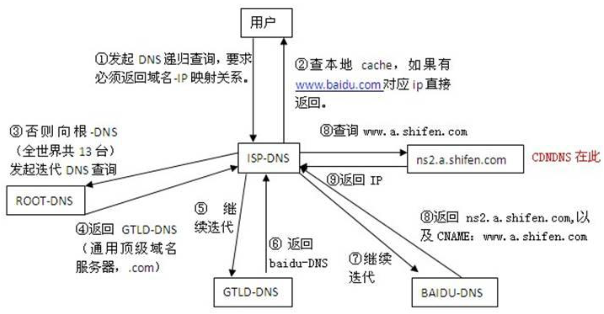

# 计算机网络

<https://zbs4017.cn/2021/03/04/%E8%AE%A1%E7%AE%97%E6%9C%BA%E7%BD%91%E7%BB%9C%E7%9F%A5%E8%AF%86%E6%80%BB%E7%BB%93/#%E4%BC%A0%E8%BE%93%E5%B1%82>

## TCP和UDP的区别：

1）TCP提供**面向连接**的传输，通信前要先建立连接（三次握手机制）；UDP提供无连接的传输，通信前不需要建立连接。

2）TCP提供**可靠的传输**（有序，无差错，不丢失，不重复）；UDP提供不可靠的传输。

3）TCP面向**字节流**的传输，因此它能将信息**分割成组**，并在接收端将其重组；UDP是面向数据报的传输，没有分组开销。

4）TCP提供**拥塞控制和流量控制机制**；UDP不提供拥塞控制和流量控制机制。

## 输入一个 url 到页面显示之间的过程

1. DNS 域名解析:将 url 解析为 ip 地址。
   1. 三层缓存，在从根域名迭代，存到LDNS
2. 请求 TCP 连接:浏览器根据解析到的 ip 地址，向对应服务器发起 TCP 连接，进行三次握手。
3. 发送 HTTP 请求:连接成功后，浏览器向服务器发送 http 请求
4. 返回 HTTP 响应:
5. 页面渲染:
6. 保持 TCP 连接(长连接)。如果 HTTP 请求的首部有设置 Connection:keep-alive 或采用的是 HTTP1.0，那么认为该连接 采用的长连接，在请求完资源后，不会立即关闭 TCP 连接
7. 断开 TCP 连接:通过四次挥手关闭 TCP 连接

## DNS 解析过程

第二步之后还要查询本地域名服务器LDNS缓存

最后查好还需在LDNS缓存
